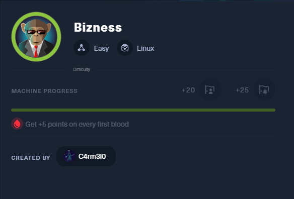

ip==10.10.11.252

```
┌──(root㉿kali)-[/home/kali/htb/Ouija]
└─# echo "10.10.11.252 bizness.htb" >> /etc/hosts
```

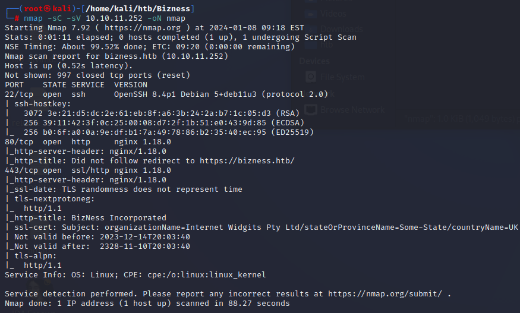

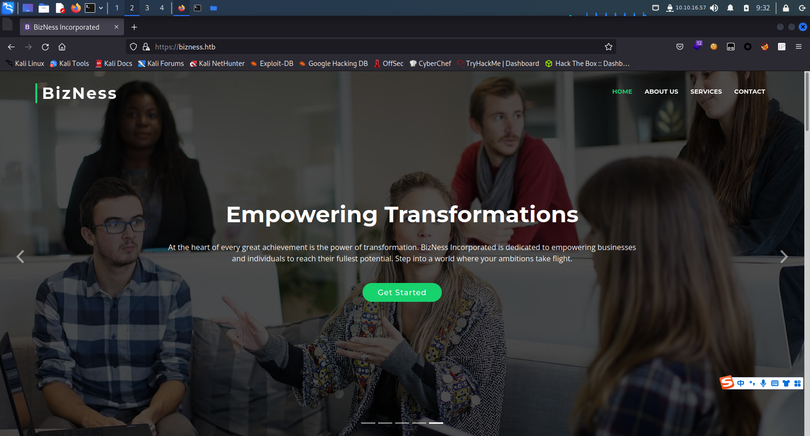

dirsearch后发现login

```
/control/login
```

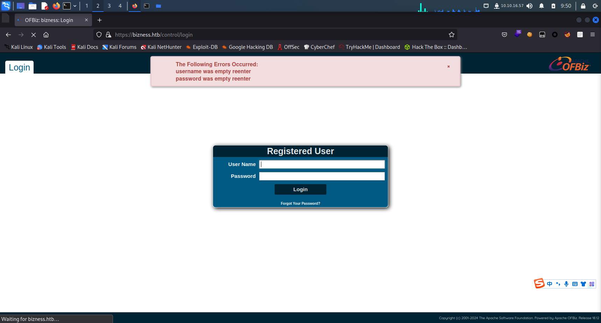

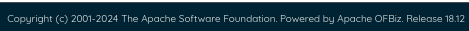

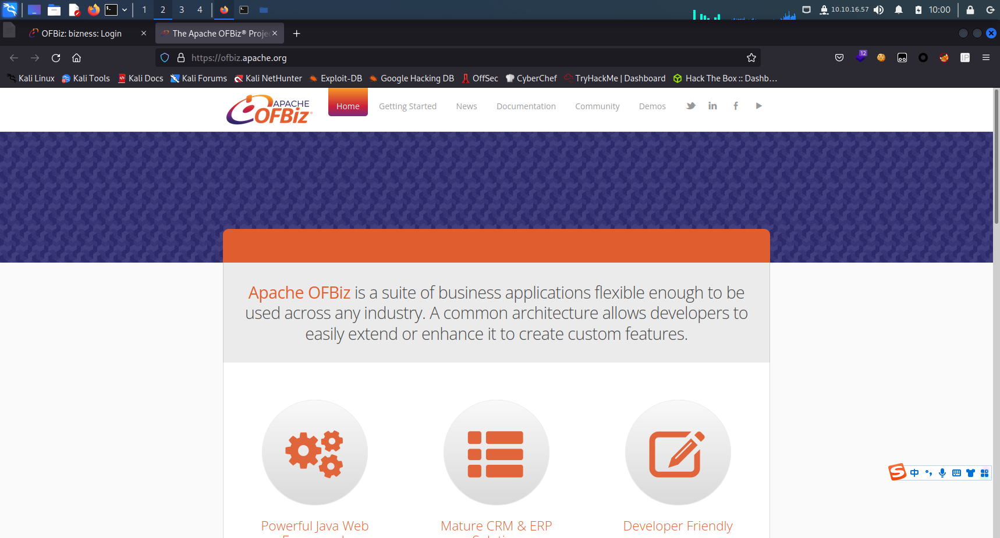

POC:

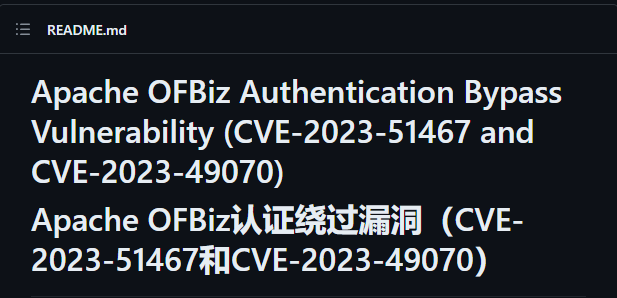

https://github.com/jakabakos/Apache-OFBiz-Authentication-Bypass

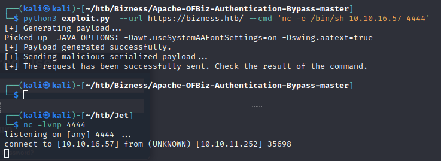

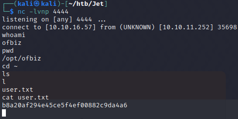

user.txt

```
b8a20af294e45ce5f4ef00882c9da4a6
```

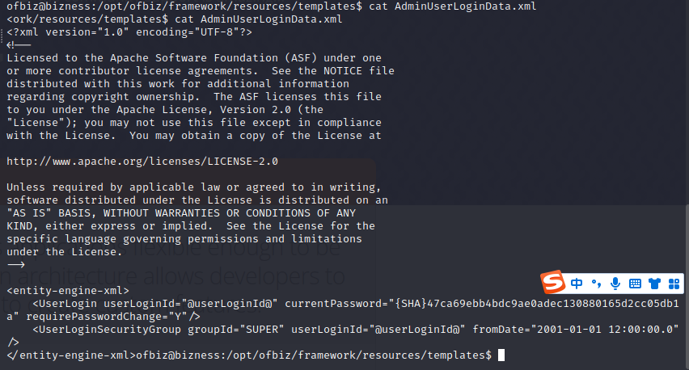

```
<entity-engine-xml>
    <UserLogin userLoginId="@userLoginId@" currentPassword="{SHA}47ca69ebb4bdc9ae0adec130880165d2cc05db1a" requirePasswordChange="Y"/>
    <UserLoginSecurityGroup groupId="SUPER" userLoginId="@userLoginId@" fromDate="2001-01-01 12:00:00.0"/>
```

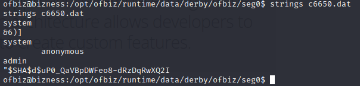

解密（碰撞）即可

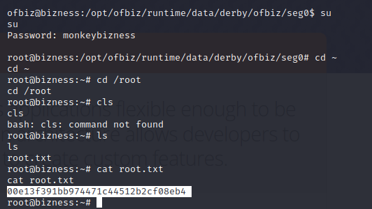

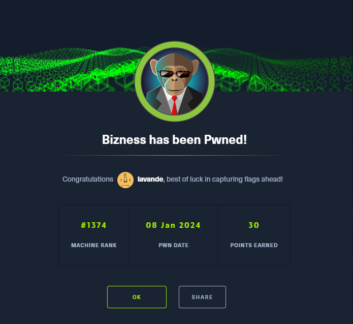
