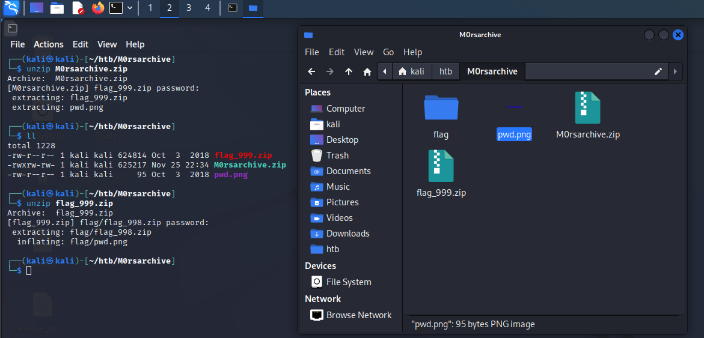
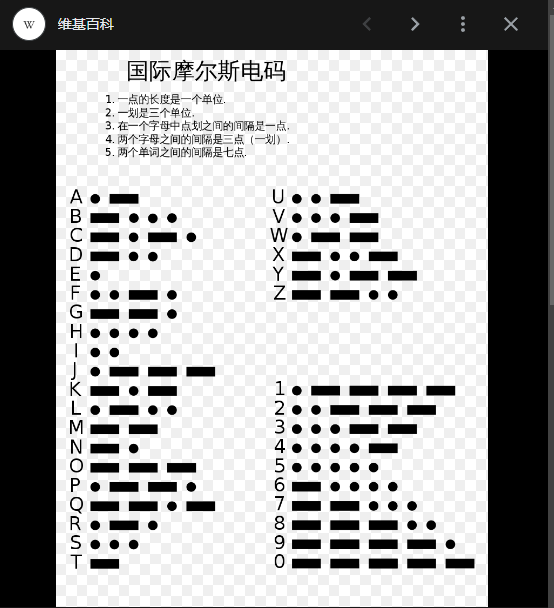
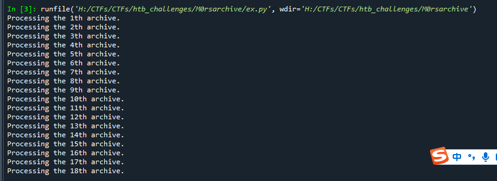
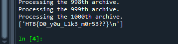

描述：

```
CHALLENGE DESCRIPTION
Just unzip the archive ... several times ...
```



看出要解压1000次

png文件为每次的解压密码 摩斯电码：9




编写ex.py 

```
import re
import os
import sys
import zipfile
from PIL import Image

#根据摩斯密码表查值
def get_pass(morse_list):
    password = ""
    MORSE_CODE_DICT = {'.-': 'a', '-...': 'b', '-.-.': 'c', '-..': 'd','.': 'e', '..-.': 'f', '--.': 'g', '....': 'h','..': 'i', '.---': 'j', '-.-': 'k', '.-..': 'l','--': 'm', '-.': 'n', '---': 'o', '.--.': 'p','--.-': 'q', '.-.': 'r', '...': 's', '-': 't','..-': 'u', '...-': 'v', '.--': 'w', '-..-': 'x','-.--': 'y', '--..': 'z', '-----': '0', '.----': '1','..---': '2', '...--': '3', '....-': '4', '.....': '5','-....': '6', '--...': '7', '---..': '8', '----.': '9','-..-.': '/', '.-.-.-': '.', '-.--.-': ')', '..--..': '?','-.--.': '(', '-....-': '-', '--..--': ','}
    for morse in morse_list:
        password += MORSE_CODE_DICT.get(morse)
    return password


#从图片中读取摩斯密码
def get_morse():
    fp = open('./pwd.png', 'rb')
    image = Image.open(fp)
    pixel = list(image.getdata())
    background = pixel[0]
    chars = []
    for i,v in enumerate(pixel):
        if v == background:
                chars.append(" ")
        else:
                chars.append("*")
    output =  "".join(chars)
    """正则匹配测试建议：https://regex101.com/
    ^  : asserts position at start of a line
    $  : asserts position at the end of a line
    \s : matches any whitespace character (equivalent to [\r\n\t\f\v ])
    *  : matches the previous token between zero and unlimited times, as many times as possible, giving back as needed (greedy)
    \* : matches the character *
    {3}: matches the previous token exactly 3 times
    """
    output = re.sub(r'^\s*', '', output)   #匹配开头的任意个空白字符，并替换为空
    output = re.sub(r'\s*$', '', output)   #匹配结尾的任意个空白字符，并替换为空
    output = re.sub(r'\*{3}', '-', output) #匹配3个*号，并替换为字符"-"
    output = re.sub(r'\*', '.', output)    #匹配单个*号，并替换为字符"."
    output = re.sub(r'\s{2,}', ' | ', output)  #(用于处理多行摩斯密码的情况)匹配两个以上空白字符，如果存在，就替换为"|"
    output = re.sub(r'\s', '', output)     #匹配空白字符，并替换为空
    output = output.split('|')
    fp.close()
    return output


#指定密码解压压缩包
def unzip_file(path, number, password):
    zip_path = "flag_" + str(1000-number) + ".zip"
    fp = zipfile.ZipFile(zip_path)
    for file in fp.namelist():
        fp.extract(file,"./",pwd=password.encode("utf-8"))
    fp.close()


def main():
    path = sys.path[0]            #当前脚本的运行目录
    
    for number in range(1,1001):
        print("Processing the "+ str(number) + "th archive.")
        #print(os.listdir('.'))   #显示当前目录下的所有文件
        morse_list = get_morse()
        password = get_pass(morse_list)
        unzip_file(path, number, password)
        path = "./flag"
        os.chdir(path)       #切换当前工作目录(进入flag子目录)
    
    fp = open('./flag', 'r')
    flag = fp.readlines()
    print(flag)
    fp.close()


if __name__ == "__main__":
    main()

```






```
HTB{D0_y0u_L1k3_m0r53??}
```


