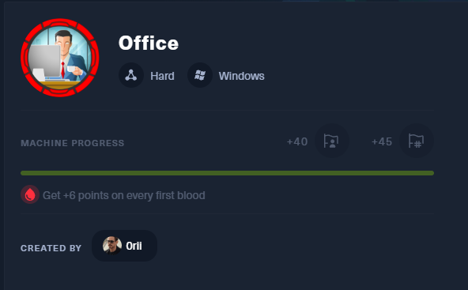

nmap

```bash
┌──(kali㉿kali)-[~/htb/Office]
└─$ nmap -sC -sV -A --min-rate 10000 10.10.11.3 -oN nmap
Starting Nmap 7.92 ( https://nmap.org ) at 2024-02-23 21:49 EST
Stats: 0:01:08 elapsed; 0 hosts completed (1 up), 1 undergoing Script Scan
NSE Timing: About 99.15% done; ETC: 21:50 (0:00:00 remaining)
Nmap scan report for 10.10.11.3 (10.10.11.3)
Host is up (0.72s latency).
Not shown: 988 filtered tcp ports (no-response)
PORT     STATE SERVICE       VERSION
53/tcp   open  domain        Simple DNS Plus
80/tcp   open  http          Apache httpd 2.4.56 ((Win64) OpenSSL/1.1.1t PHP/8.0.28)
| http-robots.txt: 16 disallowed entries (15 shown)
| /joomla/administrator/ /administrator/ /api/ /bin/ 
| /cache/ /cli/ /components/ /includes/ /installation/ 
|_/language/ /layouts/ /libraries/ /logs/ /modules/ /plugins/
|_http-title: Error: 403
|_http-generator: Joomla! - Open Source Content Management
|_http-server-header: Apache/2.4.56 (Win64) OpenSSL/1.1.1t PHP/8.0.28
88/tcp   open  kerberos-sec  Microsoft Windows Kerberos (server time: 2024-02-24 10:49:17Z)
139/tcp  open  netbios-ssn   Microsoft Windows netbios-ssn
389/tcp  open  ldap          Microsoft Windows Active Directory LDAP (Domain: office.htb0., Site: Default-First-Site-Name)
| ssl-cert: Subject: commonName=DC.office.htb
| Subject Alternative Name: othername:<unsupported>, DNS:DC.office.htb
| Not valid before: 2023-05-10T12:36:58
|_Not valid after:  2024-05-09T12:36:58
|_ssl-date: TLS randomness does not represent time
443/tcp  open  ssl/http      Apache httpd 2.4.56 (OpenSSL/1.1.1t PHP/8.0.28)
| tls-alpn: 
|_  http/1.1
| ssl-cert: Subject: commonName=localhost
| Not valid before: 2009-11-10T23:48:47
|_Not valid after:  2019-11-08T23:48:47
|_http-server-header: Apache/2.4.56 (Win64) OpenSSL/1.1.1t PHP/8.0.28
|_ssl-date: TLS randomness does not represent time
|_http-title: 403 Forbidden
445/tcp  open  microsoft-ds?
464/tcp  open  kpasswd5?
593/tcp  open  ncacn_http    Microsoft Windows RPC over HTTP 1.0
636/tcp  open  ssl/ldap      Microsoft Windows Active Directory LDAP (Domain: office.htb0., Site: Default-First-Site-Name)
|_ssl-date: TLS randomness does not represent time
| ssl-cert: Subject: commonName=DC.office.htb
| Subject Alternative Name: othername:<unsupported>, DNS:DC.office.htb
| Not valid before: 2023-05-10T12:36:58
|_Not valid after:  2024-05-09T12:36:58
3268/tcp open  ldap          Microsoft Windows Active Directory LDAP (Domain: office.htb0., Site: Default-First-Site-Name)
|_ssl-date: TLS randomness does not represent time
| ssl-cert: Subject: commonName=DC.office.htb
| Subject Alternative Name: othername:<unsupported>, DNS:DC.office.htb
| Not valid before: 2023-05-10T12:36:58
|_Not valid after:  2024-05-09T12:36:58
3269/tcp open  ssl/ldap      Microsoft Windows Active Directory LDAP (Domain: office.htb0., Site: Default-First-Site-Name)
|_ssl-date: TLS randomness does not represent time
| ssl-cert: Subject: commonName=DC.office.htb
| Subject Alternative Name: othername:<unsupported>, DNS:DC.office.htb
| Not valid before: 2023-05-10T12:36:58
|_Not valid after:  2024-05-09T12:36:58
Service Info: Hosts: DC, www.example.com; OS: Windows; CPE: cpe:/o:microsoft:windows

Host script results:
|_clock-skew: 7h59m58s
| smb2-security-mode: 
|   3.1.1: 
|_    Message signing enabled and required
| smb2-time: 
|   date: 2024-02-24T10:50:11
|_  start_date: N/A

Service detection performed. Please report any incorrect results at https://nmap.org/submit/ .
Nmap done: 1 IP address (1 host up) scanned in 110.04 seconds

```

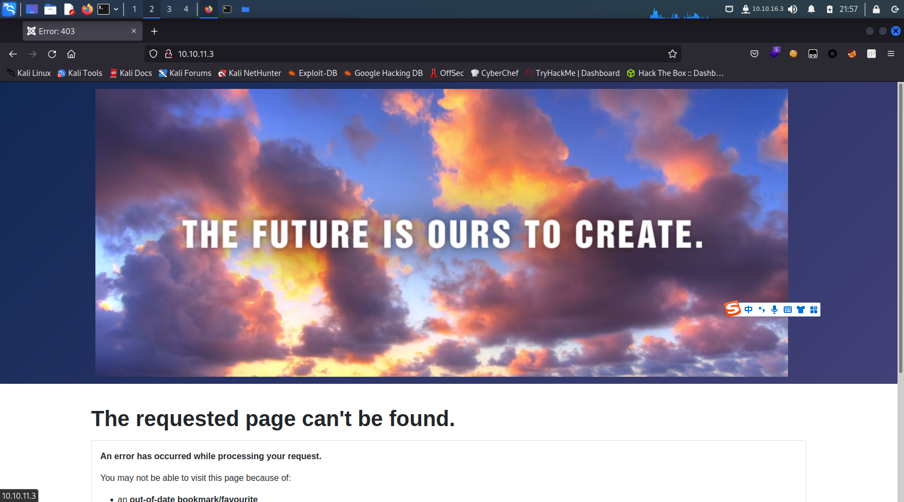

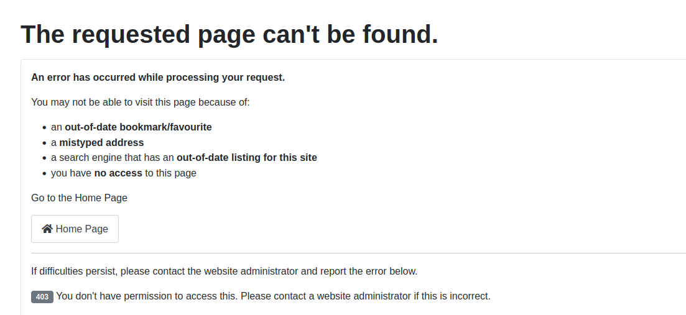

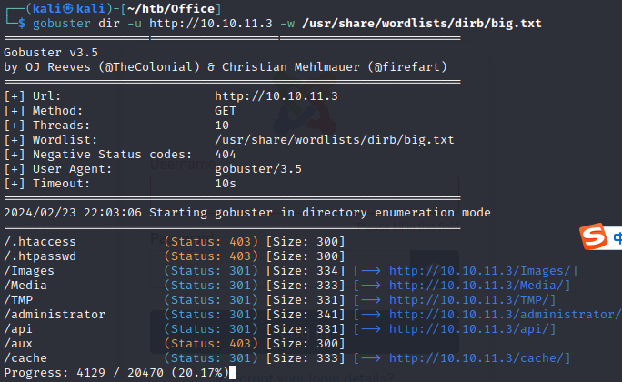

administrator

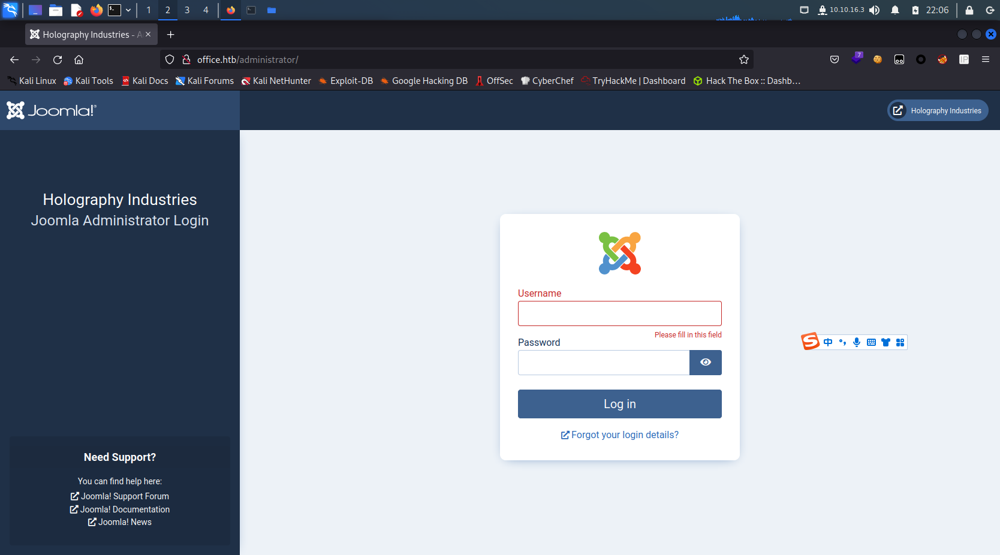

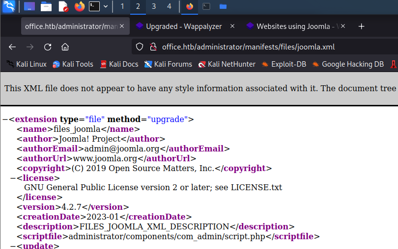

joomla 4.2.7

exploit 

https://github.com/Acceis/exploit-CVE-2023-23752

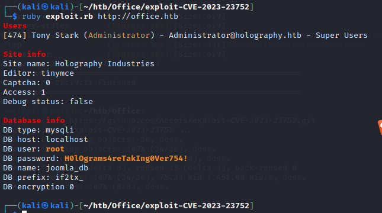

```
root
H0lOgrams4reTakIng0Ver754!
```

登不上去，可能是打补丁了

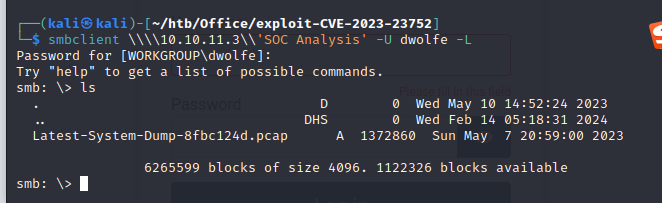

https://vbscrub.com/2020/02/27/getting-passwords-from-kerberos-pre-authentication-packets/

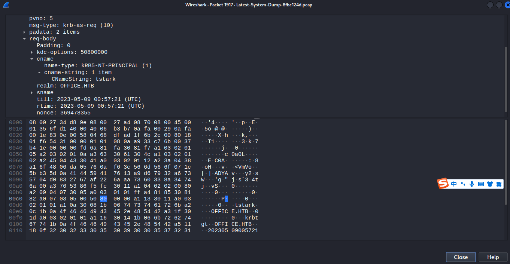

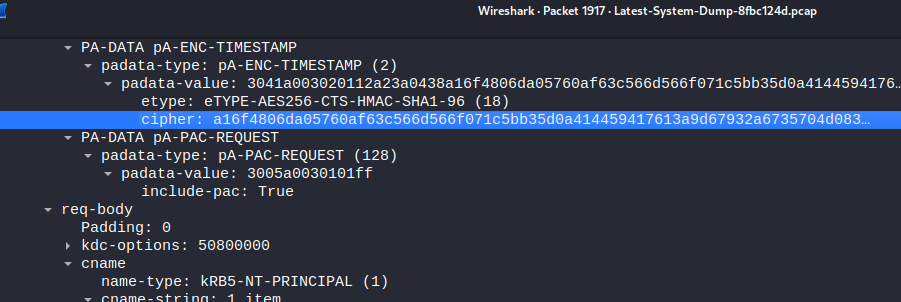

```
a16f4806da05760af63c566d566f071c5bb35d0a414459417613a9d67932a6735704d0832767af226aaa7360338a34746a00a3765386f5fc
```

```
$krb5pa$18$tstark$OFFICE.HTB$a16f4806da05760af63c566d566f071c5bb35d0a414459417613a9d67932a6735704d0832767af226aaa7360338a34746a00a3765386f5fc
```

playboy69

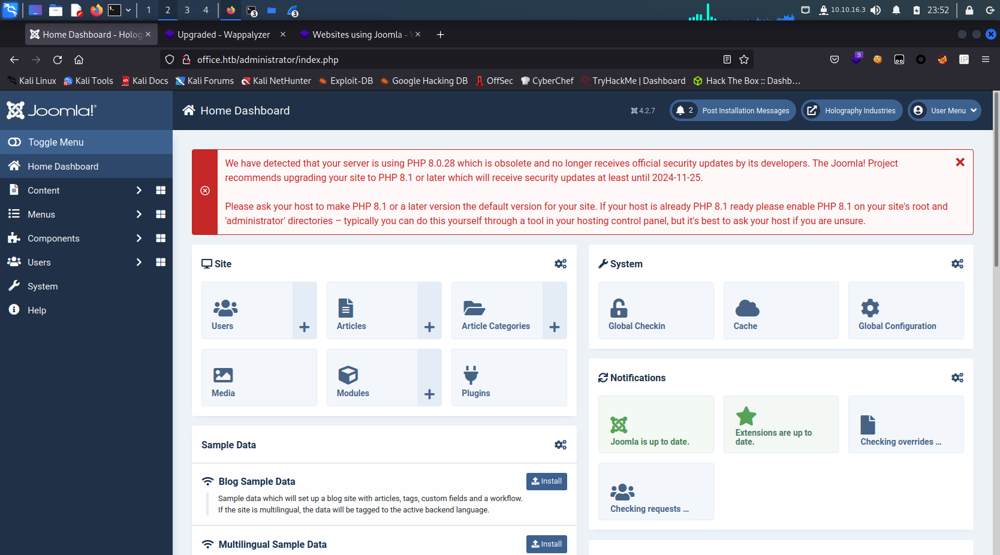
