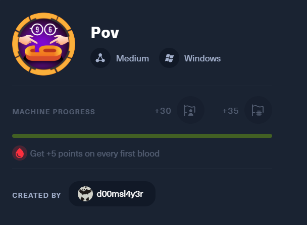

nmap扫描

```bash
└─$ nmap -sC -sV -T4 10.10.11.251 -oN nmap
Starting Nmap 7.92 ( https://nmap.org ) at 2024-02-03 04:50 EST
Nmap scan report for 10.10.11.251 (10.10.11.251)
Host is up (0.29s latency).
Not shown: 999 filtered tcp ports (no-response)
PORT   STATE SERVICE VERSION
80/tcp open  http    Microsoft IIS httpd 10.0
|_http-server-header: Microsoft-IIS/10.0
|_http-title: pov.htb
| http-methods: 
|_  Potentially risky methods: TRACE
Service Info: OS: Windows; CPE: cpe:/o:microsoft:windows

Service detection performed. Please report any incorrect results at https://nmap.org/submit/ .
Nmap done: 1 IP address (1 host up) scanned in 38.49 seconds
```

访问页面


发现sfitz@pov.htb 和 dev.pov.htb

将dev.pov.htb加入hosts文件后进行访问


拦截download操作

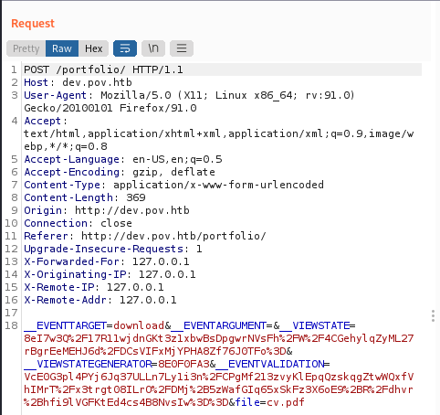

更改cv.pdf为其他参数

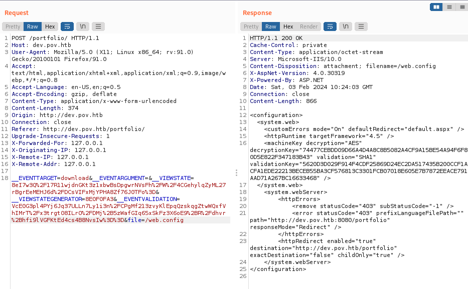

https://book.hacktricks.xyz/pentesting-web/deserialization/exploiting-__viewstate-parameter?source=post_page-----7516c938c688--------------------------------

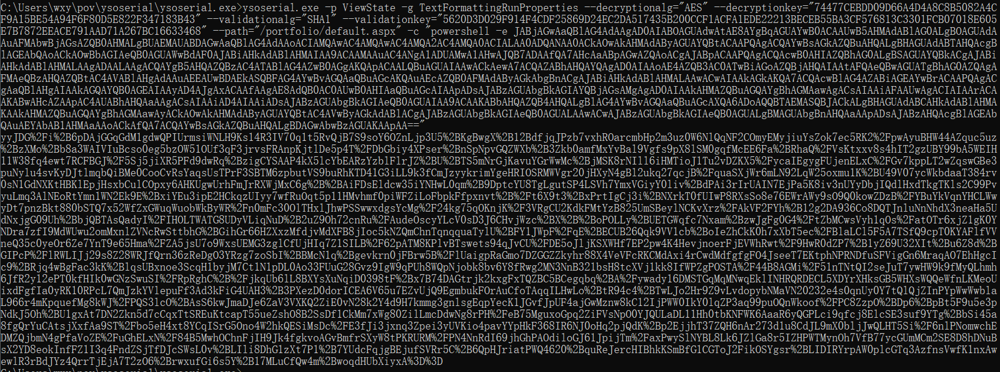

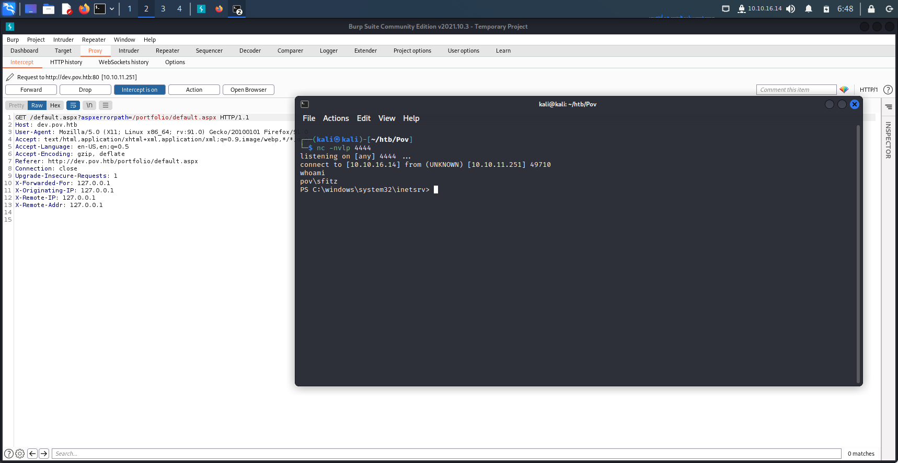

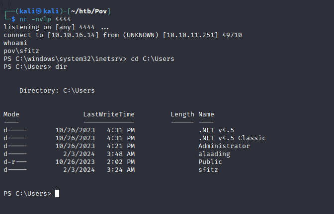

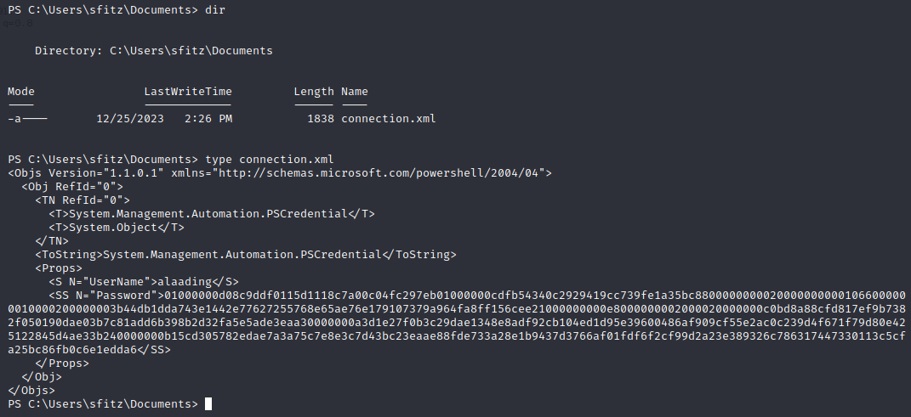

破解密码

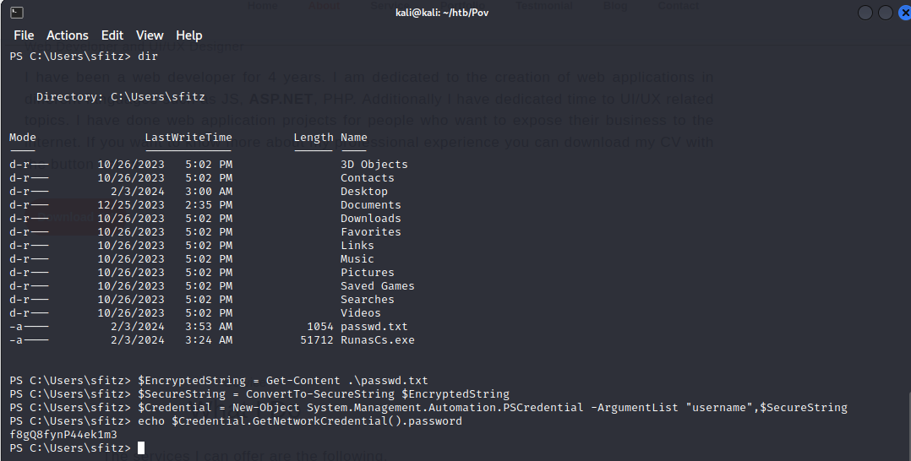

```
f8gQ8fynP44ek1m3
```

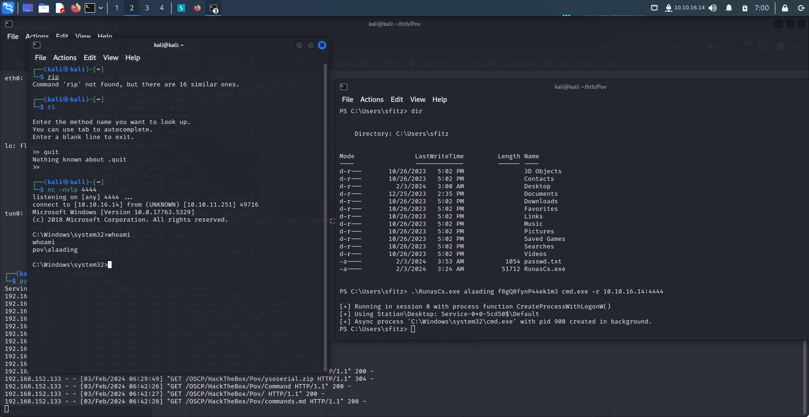

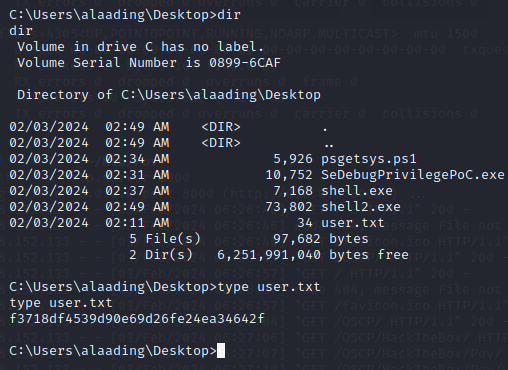

```
f3718df4539d90e69d26fe24ea34642f
```

Root

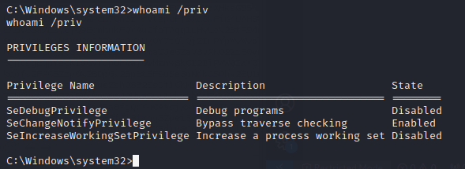

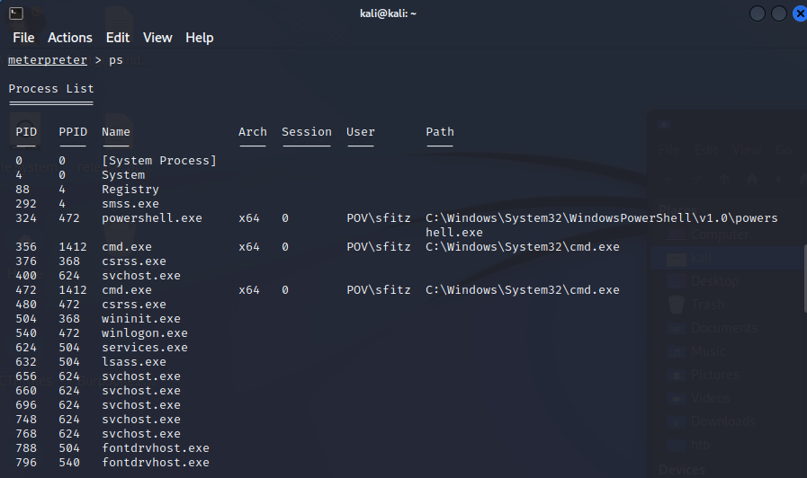

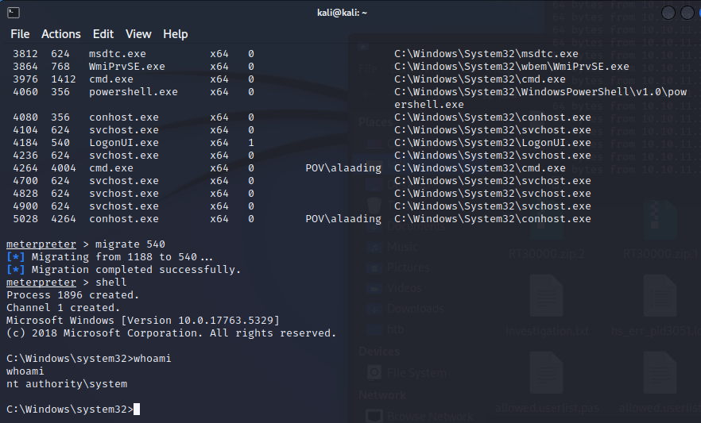

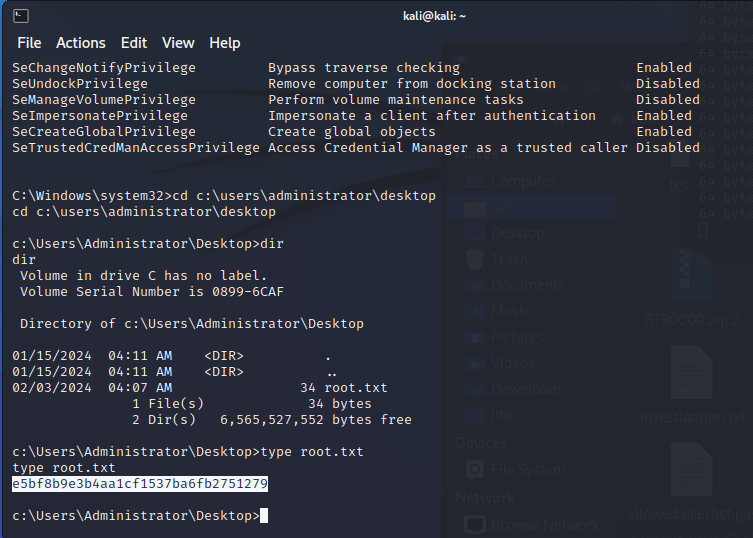

```
e5bf8b9e3b4aa1cf1537ba6fb2751279
```

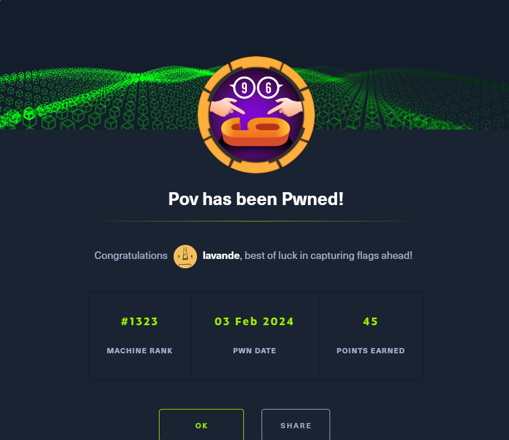
